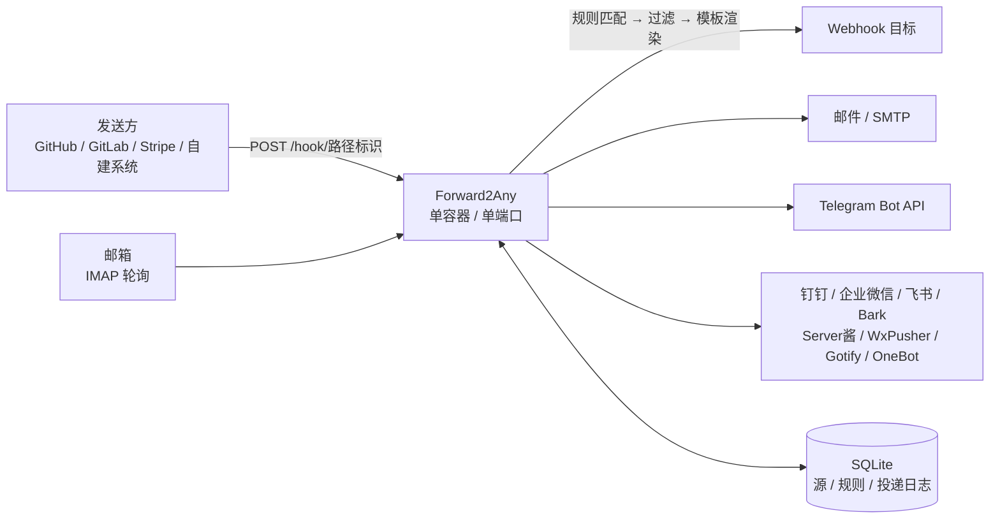
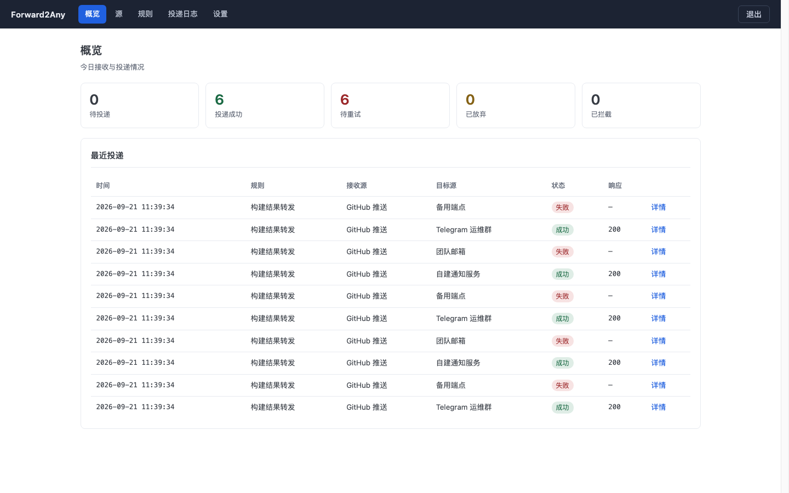
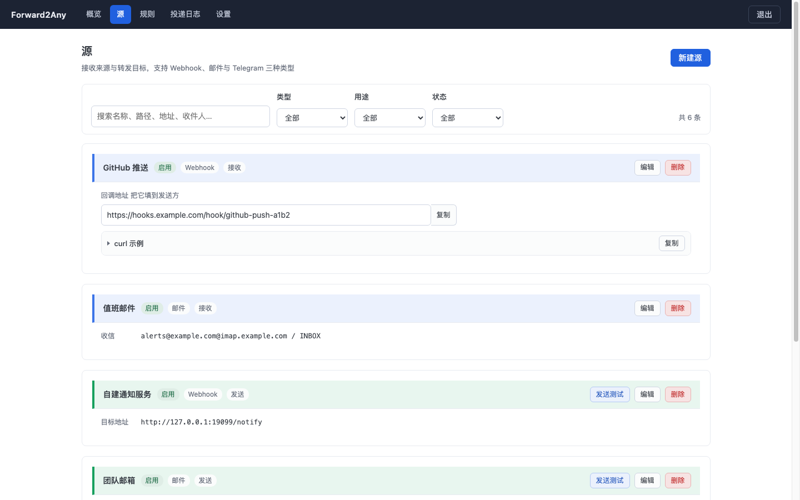
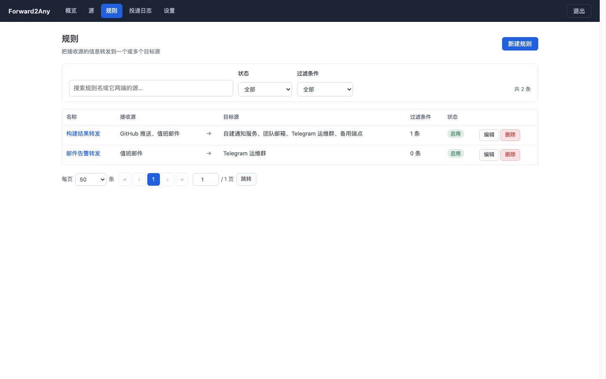
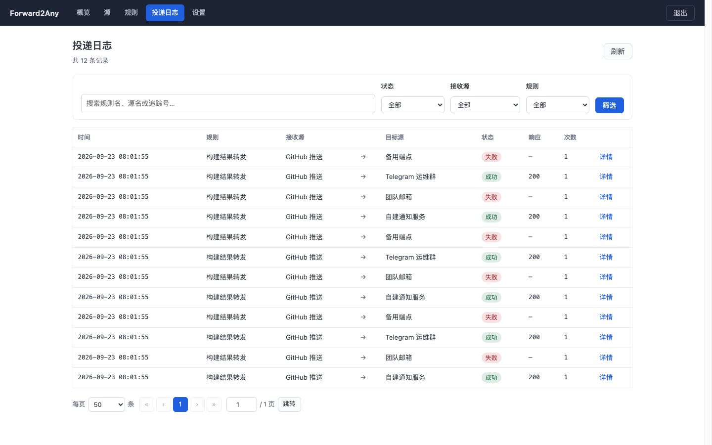
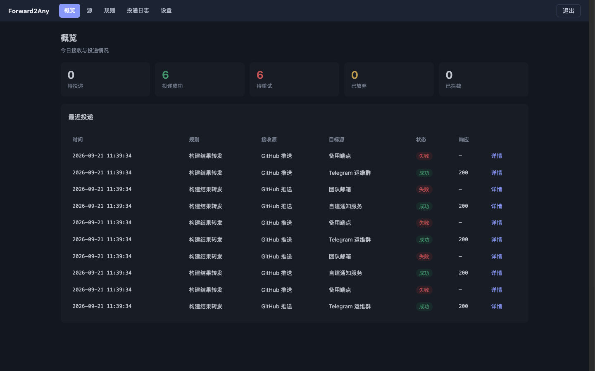
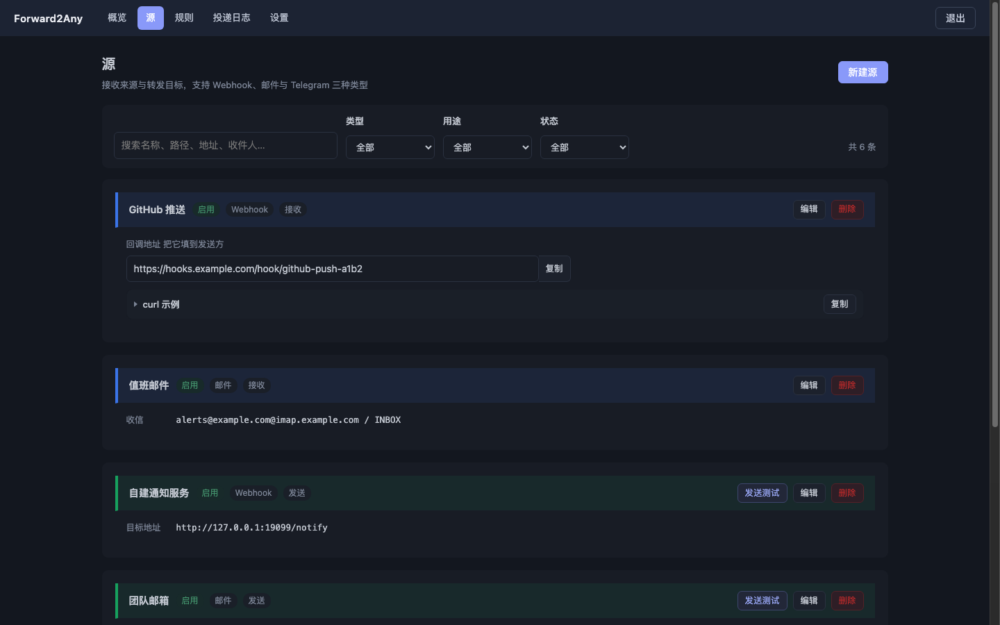

<div align="center">


# Forward2Any

接收 Webhook 与邮件，按规则转发到一个或多个 Webhook / 邮箱 / Telegram。

[](go.mod)
[](Dockerfile)
[](https://github.com/loarland/Forward2Any/actions/workflows/docker.yml)
[](https://github.com/loarland/Forward2Any/releases)
[](LICENSE)
[](https://github.com/loarland/Forward2Any/stargazers)
[](https://github.com/loarland/Forward2Any/forks)

</div>

## 项目简介

Forward2Any 是一个自托管的**消息转发中继**：接收 Webhook 或邮件，按配置的规则转发到一个或多个
Webhook、邮箱或 Telegram。

适用场景：同一个事件需要通知多个位置（CI 结果进群、抄送邮箱、再推送到自建系统）。
只需在 Forward2Any 配置一次接收与分发规则，不必在每个发送方各配一遍 Webhook。

- **单端口**：后台界面与所有 Webhook 接收端点共用同一个端口，通过路径区分。新增接收源不需要开端口，
  也不需要修改 Docker 配置和防火墙。
- **单二进制**：整个程序（含后台界面）编译成一个静态文件，Docker 镜像约 18MB，
  基于 distroless，前端不引入 npm 构建链。
- **投递可靠**：投递失败按指数退避自动重试，进程重启后自动接管未完成的投递，失败的可在后台手动重放。

适用于自有 VPS / NAS，为 CI、监控告警、表单、邮件提供统一转发层的场景。

## 目录

- [项目简介](#项目简介)
- [特性](#特性)
- [系统架构](#系统架构)
- [快速开始](#快速开始)
- [二进制部署与 systemd 服务](#二进制部署与-systemd-服务)
- [首次使用](#首次使用)
- [核心概念](#核心概念)
- [源](#源)
- [规则](#规则)
- [投递日志与重试](#投递日志与重试)
- [时区](#时区)
- [网络代理](#网络代理)
- [回调地址与单端口](#回调地址与单端口)
- [外观与主题](#外观与主题)
- [环境变量](#环境变量)
- [数据与备份](#数据与备份)
- [安全说明](#安全说明)
- [升级](#升级)
- [常见问题](#常见问题)
- [界面预览](#界面预览)
- [项目结构](#项目结构)
- [开发](#开发)
- [许可证](#许可证)

## 特性

| 模块 | 能力 |
| --- | --- |
| 接收 | Webhook（路径标识 + 密钥 / HMAC-SHA256 签名 / HTTP Basic / IP 白名单）、IMAP 轮询收信 |
| 发送 | Webhook（自定义方法、请求头、报文模板）、SMTP 邮件、Telegram Bot API、内置渠道（钉钉 / 企业微信 / 飞书 / Bark / Server酱 / WxPusher / Gotify / OneBot） |
| 规则 | 多接收源 → 多目标源、过滤条件、模板转换、循环检测 |
| 过滤 | `eq` `ne` `gt` `lt` `contains` `not_contains` `exists` `not_exists` `regex` `in`，可视化编辑或文本模式 |
| 模板 | Go template 语法，可改写报文体、邮件主题、请求头；保存前校验语法 |
| 投递 | 指数退避重试、原始报文与渲染结果并排对照、目标响应码与响应体、转发跳链、手动重放 |
| 代理 | HTTP / HTTPS / SOCKS5，全局配置 + 每个源单独勾选 |
| 外观 | 20 种配色 × 亮色 / 深色 / 跟随系统，修改后即时预览 |
| 运维 | 配置导入导出、日志保留期、监听端口热切换、容器健康检查 |
| 安全 | bcrypt 密码、HttpOnly 会话、写操作校验来源、登录失败锁定、可选 Cloudflare Turnstile 人机校验、Bot Token 与渠道凭据脱敏、数据库 0600 |

## 系统架构



数据流：

1. 发送方把事件 POST 到 `/hook/<路径标识>`，或者由程序轮询 IMAP 邮箱把新邮件收进来。
2. 程序按接收源匹配规则，逐个跑过滤条件，命中的才继续。
3. 按模板渲染出实际要发的内容，分发给规则的每一个目标源。
4. 每个目标的每一次转发都独立落一条投递记录，各自重试，互不影响。

## 快速开始

### 方式一：一键脚本（推荐，Linux + systemd）

在干净的 Linux 服务器上执行一条命令即可完成安装：下载发布包、校验 sha256、安装二进制、
创建系统用户与数据目录、写入 systemd 单元、启动并等待健康检查通过。

```bash
curl -fsSL https://raw.githubusercontent.com/loarland/Forward2Any/main/scripts/install.sh | sudo bash
```

安装完成后会打印后台地址和管理员密码。建议先下载脚本查看内容，再执行：

```bash
curl -fsSLO https://raw.githubusercontent.com/loarland/Forward2Any/main/scripts/install.sh
sudo bash install.sh
```

首次安装可用环境变量覆盖以下引导值（都会写入 `/etc/forward2any.env`）：

```bash
sudo F2A_PORT=9000 \
     F2A_BASE_URL="https://hooks.example.com" \
     F2A_ADMIN_PASSWORD="替换为自定义强密码" \
     bash install.sh
```

后续升级、查看状态与卸载：

```bash
sudo bash install.sh upgrade              # 仅替换二进制与单元文件，数据与配置不变
sudo bash install.sh status               # 版本 + systemd 状态 + 健康检查
sudo bash install.sh uninstall            # 停服务、删除单元与二进制，保留数据
sudo bash install.sh uninstall --purge    # 同时删除数据
```

安装的文件清单、端口修改与备份等细节见[二进制部署与 systemd 服务](#二进制部署与-systemd-服务)。

### 方式二：Docker Compose（拉现成镜像）

镜像由 GitHub Actions 自动构建并推到 GHCR，`linux/amd64` 和 `linux/arm64` 都有，
服务器上不需要 clone 代码，也不需要安装 Go：

```bash
git clone https://github.com/loarland/Forward2Any.git
cd Forward2Any

cp .env.example .env     # 端口、回调地址、管理员密码在这里修改；不修改也可直接启动
docker compose up -d
```

`.env.example` 里每一项都有注释，常用的几项：`F2A_HOST_PORT`（宿主端口）、`F2A_BASE_URL`
（回调基址）、`F2A_ADMIN_PASSWORD`、`F2A_DATA_DIR`（数据目录）、`F2A_UID` / `F2A_GID`
（容器进程身份，默认 `0`，见[数据与备份](#数据与备份)）。

`docker-compose.yml` 默认用 `image: ghcr.io/loarland/forward2any:latest`（先拉再起）。
不 clone 仓库的话直接 `docker run`：

```bash
docker run -d --name forward2any --restart unless-stopped \
  -p 16000:16000 \
  -v f2a-data:/data \
  -e F2A_BASE_URL="https://hooks.example.com" \
  -e F2A_ADMIN_PASSWORD="$(openssl rand -base64 18)" \
  ghcr.io/loarland/forward2any:latest
```

数据保存在 `f2a-data` 卷中，容器删除重建不会丢失；在宿主机上直接访问数据文件的方法见[数据与备份](#数据与备份)。

| 镜像标签 | 指向 |
| --- | --- |
| `latest` | **最新发布的版本**，只在打版本标签时更新 |
| `main` | main 分支上最后一个提交的构建（可能包含没发布的改动） |
| `1.0.10` | 打了 `v1.0.10` 这样的标签时产生，每个版本一个标签 |
| `sha-2262653` | 对应某一次提交，想固定到某个具体构建就用它 |

需要本地从源码构建时，把 compose 里的 `image:` 行换成 `build: .`。

宿主端口被占用时修改 `F2A_HOST_PORT`（容器内监听端口不变）：在 `.env` 中修改，
或在命令行上临时覆盖（命令行优先）：

```bash
F2A_HOST_PORT=9000 docker compose up -d
```

`F2A_BASE_URL` 未显式设置时会跟随端口变化，不需要单独修改。

> 镜像公开，`docker pull` 不需要登录。国内直连 `ghcr.io` 可能不稳定，可配置镜像加速或改用方式一。

> `F2A_BASE_URL` 决定后台显示的回调地址与 curl 示例。服务位于反向代理后面时，
> 必须填写外部可访问的地址，不能填 `localhost`。

### 方式三：源码运行

需要 Go 1.27 或更高版本：

```bash
go build -o f2a ./cmd/f2a
F2A_ADMIN_PASSWORD="$(openssl rand -base64 18)" ./f2a
```

也可以直接运行 `go run ./cmd/f2a`。

### 未设置管理员密码时

未提供 `F2A_ADMIN_PASSWORD` 时使用默认密码 `f2a`。该密码**仅用于首次登录**：用它登录后，
后台除「设置」页外的所有页面都会被重定向回设置页，必须先修改密码才能继续使用。
需要跳过这一步时，在启动前通过 `F2A_ADMIN_PASSWORD` 指定自定义密码。

## 二进制部署与 systemd 服务

不使用 Docker 时可直接运行二进制。发布包为静态编译（`CGO_ENABLED=0`），不依赖 glibc，Alpine 亦可运行。

一键脚本安装的文件位于以下路径，手动安装时沿用同一套约定：

| 东西 | 路径 |
| --- | --- |
| 二进制 | `/usr/local/bin/f2a` |
| 数据目录 | `/var/lib/forward2any`（SQLite 库在里面，权限 0700、属主 `f2a`） |
| 环境变量 | `/etc/forward2any.env`（0600，只在首次启动时作为引导值） |
| systemd 单元 | `/etc/systemd/system/forward2any.service` |
| 运行用户 | `f2a`（系统用户，没有登录 shell） |
| 许可原文 | `/usr/local/share/doc/forward2any/LICENSE`（Apache-2.0 要求随分发附带） |

### 手动安装

每个发布包（`forward2any_<版本>_linux_<架构>.tar.gz`）包含二进制、systemd 单元和 LICENSE：

```bash
ver=1.0.10       # 按需替换为实际版本；amd64 / arm64 按机器架构选择
base="https://github.com/loarland/Forward2Any/releases/download/v${ver}"
curl -fsSLO "${base}/forward2any_${ver}_linux_amd64.tar.gz"
curl -fsSLO "${base}/checksums.txt"
sha256sum -c --ignore-missing checksums.txt      # 校验下载文件
tar -xzf "forward2any_${ver}_linux_amd64.tar.gz"
cd "forward2any_${ver}_linux_amd64"

sudo install -m 0755 f2a /usr/local/bin/f2a
nologin=$(command -v nologin || echo /bin/false)
sudo useradd --system --no-create-home --home-dir /var/lib/forward2any --shell "$nologin" f2a
sudo install -d -m 0700 -o f2a -g f2a /var/lib/forward2any
sudo install -m 0644 forward2any.service /etc/systemd/system/forward2any.service

# 首次启动的引导值写在这里（0600，含密码）
sudo install -m 0600 -o root -g root /dev/stdin /etc/forward2any.env <<'EOF'
F2A_DATA_DIR=/var/lib/forward2any
F2A_PORT=16000
F2A_ADMIN_USER=admin
F2A_BASE_URL=https://hooks.example.com
F2A_LOG_LEVEL=info
F2A_ADMIN_PASSWORD=替换为自定义强密码
EOF

sudo systemctl daemon-reload
sudo systemctl enable --now forward2any
f2a version                                      # 确认装上的是哪个版本
curl -fsS http://127.0.0.1:16000/healthz         # 健康检查，返回 ok 即正常
```

> 使用二进制自带的探活命令（`f2a healthcheck`，按数据库中的实际端口探测）时，**必须以服务用户身份运行**：
> `sudo -u f2a env F2A_DATA_DIR=/var/lib/forward2any f2a healthcheck` ——
> 以 root 运行会在数据目录留下 root 属主的 `-wal` / `-shm` 文件，导致服务无法打开数据库。

> `F2A_BASE_URL` 必须填外部可访问的地址（域名或公网 IP）：回调 URL 与 curl 示例都按它生成，
> 填 `localhost` 时发给 GitHub / Stripe 的回调地址无效。

### 常用运维命令

```bash
systemctl status forward2any                    # 状态
journalctl -u forward2any -f                    # 查看日志（启动失败时同样看这里）
sudo systemctl restart forward2any              # 重启
sudo systemctl stop forward2any                 # 停止
sudo bash install.sh upgrade                    # 升级（重跑一键脚本，数据与配置不变）
curl -fsS http://127.0.0.1:16000/healthz        # 健康检查
```

### systemd 单元文件说明

单元文件位于仓库的 `deploy/forward2any.service`，要点如下：

- `Restart=always`，`KillSignal=SIGTERM`：收到 SIGTERM 时优雅关闭，**未完成的投递记录保留在数据库中**、
  下次启动继续投递。应避免使用 `kill -9`。
- 加固：`NoNewPrivileges`、`ProtectSystem=strict`、`ProtectHome`、`PrivateTmp`、`PrivateDevices`、
  空 `CapabilityBoundingSet`、`RestrictAddressFamilies`、`SystemCallFilter=@system-service`、
  `MemoryDenyWriteExecute`。其可写范围仅限自身数据目录。
- `ReadWritePaths=/var/lib/forward2any`：数据目录变更时这一行需同步修改（一键脚本会自动处理）。
- 监听小于 1024 的端口需要 `AmbientCapabilities=CAP_NET_BIND_SERVICE`（一键脚本会自动添加；
  默认端口 16000 不需要）。
- `UMask=0077`：数据库文件权限为 0600，其中保存 Webhook 密钥、邮箱密码与 Telegram Bot Token。

### 修改端口与密码

`/etc/forward2any.env` 中的值**只在首次启动时**写入数据库，之后以后台「设置」页为准。

- 端口在后台「设置」页修改（立即重新绑定，不需要重启服务），防火墙 / 反向代理 / `F2A_BASE_URL`
  需同步调整。
- 管理员密码在后台「设置 → 管理员账号」修改，改环境变量文件无效。
  密码已忘记见[重置管理员密码](#重置管理员密码)。

### 卸载

```bash
sudo bash install.sh uninstall            # 停服务、删单元和二进制，数据保留
sudo bash install.sh uninstall --purge    # 连数据目录、环境变量文件和系统用户一起删
```

手动安装的按上述步骤反向操作：`systemctl disable --now forward2any`、
删掉单元文件和 `/usr/local/bin/f2a`、`systemctl daemon-reload`。

## 首次使用

### 登录后台

```text
http://<服务器地址>:16000/
```

| 项目 | 值 |
| --- | --- |
| 用户名 | `admin`（可用 `F2A_ADMIN_USER` 修改，也可在设置页修改） |
| 密码 | `F2A_ADMIN_PASSWORD` 的值；未设置时为 `f2a`，登录后强制修改 |

登录后应先在「设置」页确认**回调基址**为外部可访问的地址 —— 回调 URL 与 curl 示例都按它生成。

### 配置第一条转发

以「GitHub push 通知转发到 Telegram」为例：

1. **源 → 新建源**：类型选 `Webhook`、用途选「接收」，鉴权方式选「固定密钥」并填写密钥。
   保存后页面会显示回调地址与一条可直接使用的 curl 命令，并提供复制按钮。
2. **源 → 新建源**：类型选 `Telegram`、用途选「发送」，填写 Bot Token 与 Chat ID。
   Chat ID 的获取方式见 [Telegram 发送](#telegram-发送)。
3. **规则 → 新建规则**：接收源勾选第 1 步的源，目标源勾选第 2 步的源。
   只转发 push 事件时，添加过滤条件 `action eq push`。
4. 在 GitHub 仓库的 Webhook 设置中填写第 1 步得到的回调地址。
5. 触发一次事件后到**投递日志**查看结果；也可在源列表点击「发送测试」。

## 核心概念

| 概念 | 说明 |
| --- | --- |
| **源** | 一个消息出入口。类型是 `Webhook`、`邮件` 或 `Telegram`；用途是「接收」「发送」或「两者」。 |
| **规则** | 「哪些源收到的消息 → 转发到哪些源」，外加过滤条件与模板转换。 |
| **投递** | 一次具体的转发动作。每条规则 × 每个目标源 = 一条投递记录，各自重试。 |
| **设置** | 回调基址、管理员账号、监听端口、跨站请求校验（开关 + 允许的 Origin / Referer）、网络代理、外观、时区、重试与日志保留、Cloudflare Turnstile 人机校验、配置导入导出。 |

规则两侧均支持多选，以下映射不需要额外配置：

```text
Webhook ──┐                    ┌──> Webhook A
          ├── 规则 ────────────┤
邮件    ──┘                    ├──> Webhook B
                               ├──> 邮件
                               └──> Telegram
```

> Telegram 只能作为目标（发送）使用：Bot API 的更新需要主动拉取或另外配置 Webhook，本项目不实现接收。

## 源

在「源」页面点击新建源。表单按所选类型与用途，只显示相关字段。

### Webhook 接收

| 字段 | 说明 |
| --- | --- |
| 路径标识 | 回调地址的最后一段。留空时自动生成，带随机后缀，降低被扫描命中的概率。 |
| 鉴权方式 | 见下表。 |
| IP 白名单 | 逗号分隔，支持单个 IP 与 CIDR（`203.0.113.7, 10.0.0.0/8`）。留空表示不限制。 |

| 鉴权方式 | 怎么校验 |
| --- | --- |
| 不校验 | 不校验来源。仅建议在可信内网使用。 |
| 固定密钥 | 请求头（默认 `X-F2A-Token`）或 URL 参数 `?token=` 中的值必须与密钥一致。 |
| HMAC-SHA256 签名 | 计算 `HMAC-SHA256(密钥, 原始报文)` 的十六进制，与请求头（默认 `X-Hub-Signature-256`，值形如 `sha256=...`）比对，与 GitHub 的实现一致。 |
| HTTP Basic | 「请求头名」栏填用户名，「密钥」栏填密码。 |

保存后页面会显示完整回调地址与 curl 命令，均带复制按钮。

### 接收默认模板

接收源（Webhook / 邮件）上可以配两份模板，**规则里的对应模板留空时就用它们**：

| 字段 | 规则里哪一格留空时生效 |
| --- | --- |
| 默认报文体模板 | 报文体模板 |
| 默认主题模板 | 邮件主题模板（目标为内置渠道时即消息标题） |

典型场景：上游推送的报文是 `{"title":"…","content":"…"}`，在该源上配置 `{{.Payload.title}}` /
`{{.Payload.content}}` 后，每条规则、每个目标（邮件、钉钉、飞书等）拿到的都是规整的标题与正文，
不需要在每条规则里重复填写。规则中自行填写的模板优先生效；投递日志的「原始报文（入站）」仍记录入站原文。

变量与语法跟规则里的模板完全一样，见[模板转换](#模板转换)。

### Webhook 发送

填写目标地址、请求方法，以及可选的固定请求头（JSON 对象）。规则中配置了请求头模板时以模板为准。
报文**原样透传**（或按规则模板渲染），目标要求的报文格式需自行编写 —— 钉钉、飞书等有固定报文
要求的服务请改用[内置渠道发送](#内置渠道发送)。

### 邮件接收（IMAP 轮询）

填写 IMAP 服务器、端口、用户名、密码或授权码、文件夹与轮询间隔。

- 只处理**未读**邮件；处理成功后才标记为已读，失败的邮件在下一轮重试。
- 轮询间隔小于 10 秒时按 60 秒执行（降低邮件服务器压力，避免被封禁）。
- 单轮最多处理 50 封，积压邮件在后续轮次中逐步处理。

接收的邮件会规范化为统一结构，规则中按以下字段取值：

```json
{
  "from": "a@b.com", "from_name": "张三",
  "to": ["c@d.com"], "cc": [],
  "subject": "构建成功",
  "date": "2026-01-02T15:04:05+08:00",
  "text": "纯文本正文", "html": "HTML 正文",
  "attachments": [{"filename": "log.txt", "content_type": "text/plain", "size": 1234}]
}
```

> 附件仅记录文件名、类型与大小，内容不转存。

### 邮件发送（SMTP）

填写 SMTP 服务器、端口、加密方式（STARTTLS / SSL / 不加密）、账号密码、发件人与收件人（逗号分隔多个）。

### Telegram 发送

将转发的内容作为**一条文本消息**发送到指定的群、频道或私聊。共四项配置：

| 字段 | 说明 |
| --- | --- |
| Bot Token | 在 [@BotFather](https://t.me/BotFather) 创建 bot 时获得，形如 `123456:ABC-DEF...`。 |
| Chat ID | 群与频道的 id 为**负数**；频道也可直接填写 `@频道用户名`。 |
| 消息话题 ID | 可选，对应 Bot API 的 `message_thread_id`，仅在论坛群中需要固定发到某个话题时填写。 |
| 请求端点 | 默认 `https://api.telegram.org/bot`，仅在自建 Bot API 服务器时修改。 |

**获取 Chat ID**：将 bot 加入群（频道需授予管理员权限），在群内发送一条消息，然后访问
`<请求端点><Bot Token>/getUpdates`，响应中 `result[].message.chat.id` 即为 Chat ID；私聊需先给 bot 发送一条消息。
**话题 ID** 是话题链接 `t.me/c/…/<话题ID>` 末尾的数字。

请求为标准 Bot API 格式：

```bash
curl -X POST 'https://api.telegram.org/bot<token>/sendMessage' \
  -H 'Content-Type: application/json' \
  -d '{"chat_id":-1001234567890,"message_thread_id":42,"text":"hello"}'
```

注意事项：

- **正文超过 4096 个字符直接判失败，不做截断**（按 UTF-16 码元算，这是 Telegram 单条消息的上限）。
  投递日志会记录超出量，可修改模板或改用其它目标。
- **投递结果以响应体中的 `ok` 字段为准，不看 HTTP 状态码**。Bot API 报错时同样返回 `200` + `{"ok":false}`，
  失败时把 `description` 记入日志（例如 `chat not found`）。
- **Bot Token 不会写入投递日志**：它位于 URL 路径中，落库前会被替换为 `***`。
- `api.telegram.org` 在部分网络环境下无法直连，可配合[网络代理](#网络代理)使用。

### 内置渠道发送

钉钉、企业微信、飞书、Bark、Server酱、WxPusher、Gotify、OneBot 这八种。

这些服务都提供「Webhook 地址」，但**各自的报文格式互不相同**，失败通常也表现为 HTTP 200 +
响应体中的错误码。因此它们作为独立的源类型实现：选择类型、填写地址（部分类型还需加签密钥或目标 ID），
报文由程序按各家格式生成，响应体中的业务错误码也会被识别。

| 类型 | 推送地址 | 额外字段 | 报文 |
| --- | --- | --- | --- |
| 钉钉 | 群机器人 Webhook（`oapi.dingtalk.com/robot/send?access_token=…`） | 加签密钥（开了加签才填） | markdown（标题 + 正文） |
| 企业微信 | 群机器人 Webhook（`qyapi.weixin.qq.com/cgi-bin/webhook/send?key=…`） | — | markdown，单条上限 4096 字节 |
| 飞书 | 自定义机器人 Webhook（`open.feishu.cn/open-apis/bot/v2/hook/…`） | 签名密钥（开了签名校验才填） | 互动卡片（标题 + markdown） |
| Bark | `https://api.day.app/<key>`（自建就换域名） | 分组名（可选） | 标题 + markdown |
| Server酱 | `https://sctapi.ftqq.com/<SendKey>.send` | — | 标题 + 正文 |
| WxPusher | 带 `SPT_` 的极简推送地址 | — | 正文 + 标题 |
| Gotify | `https://<域名>/message?token=<应用令牌>` | — | 标题 + markdown，优先级 5 |
| OneBot | 实现的 HTTP 接口（`/send_private_msg` 或 `/send_group_msg`） | 目标 ID（QQ 号或群号） | 纯文本：标题 + 换行 + 正文 |

规则中的两个模板在这类源上含义不同：**报文体模板 = 消息正文**（留空就原样透传入站报文），
**邮件主题模板 = 标题**（留空自动生成一个，形如 `[接收源名] 报文首行`）。

注意事项：

- **内置渠道只能作为发送源**，用途选「接收」或「接收 + 发送」会被拒绝。
- **投递结果以响应体中的错误码为准**：钉钉 / 企业微信看 `errcode`，飞书看 `code`，Bark 看 `code == 200`，
  Server酱看 `code`，WxPusher 看 `code == 1000`，Gotify 看有没有 `error`，OneBot 看 `status`/`retcode`。
  仅 HTTP 为 2xx 而响应体中带错误码时，投递记录标记为**失败**，失败原因写入详情页。
- **钉钉加签**：机器人安全设置选「加签」时，把 `SEC…` 密钥填进「加签密钥」；程序会按
  `timestamp` + `HMAC-SHA256` 算出 `sign` 拼到地址上。
  选择「自定义关键词」时不需要填密钥。钉钉机器人限速 20 条/分钟。
- **飞书签名**：机器人开了「签名校验」时必须填签名密钥，否则会被拒（`code 19021`）。
- **WxPusher** 使用[极简推送](https://wxpusher.zjiecode.com/docs/)的 SPT，扫码即可获取，
  无需创建应用并获取 UID；地址中必须包含 `SPT_`。
- **OneBot** 的目标 ID 可写成 `group:123` / `user:123`；只写数字时按地址中的
  `send_group_msg` / `send_private_msg` 判断，无法判断时直接报错，不会自行猜测。
- 需要自定义请求方法、请求头或报文格式时，使用 **Webhook 类型**（见上一节），
  报文模板的内容即为发送内容。

## 规则

「规则」页面 → 新建规则。

### 接收源与目标源

两侧各勾选一个或多个。左侧源收到消息时触发规则，消息分发给右侧每一个目标源，每个目标源产生一条
独立的投递记录并各自重试。

两栏都只列**用途匹配的源**：接收源栏只列用途含接收的源，目标源栏只列用途含发送的源；
未列出的数量在栏底说明。已选中的源即使用途变更也会保留在栏内并注明原因，
否则打开表单保存一次就会丢失该目标。源超过 6 个时栏内出现搜索框，以及「全选 / 清空」。

### 过滤条件

**全部满足**才转发；不添加任何条件表示全部转发。

表单默认使用**可视化编辑**：一行一个条件，左侧填路径、中间选操作符、右侧填值。选择
`exists` / `not_exists` 时值会置灰。右上角可切换到**文本模式**，一行一条，便于从其它位置
整段复制，也支持 `#` 注释：

```text
# 以 # 开头是注释
action eq push
repository.private eq false
commits.0.message contains [skip]
ref exists
```

**路径**用点分隔，纯数字段表示数组下标（`commits.0.id`）。

| 操作符 | 说明 |
| --- | --- |
| `eq` / `ne` | 相等 / 不等。数字按数值比，`true` 是布尔不是字符串。 |
| `gt` / `lt` | 大于 / 小于，按数值比较。 |
| `contains` / `not_contains` | 字符串包含子串，或数组包含某元素。 |
| `exists` / `not_exists` | 字段存在 / 不存在（不需要填值）。 |
| `regex` | 正则匹配。 |
| `in` | 值在给定列表里，例如 `in [push, tag]`。 |

**值**按 JSON 解析，所以这些写法都成立：

```text
count gt 3
private eq false
action in [push, tag]
message regex ^fix:
title eq "带 空格 的标题"
```

裸词（如 `push`）无法解析为 JSON 时按普通字符串处理；裸词中的连续空格会合并为一个，
需要原样保留时请使用 JSON 字符串。

### 模板转换

留空表示原样透传入站报文；填写后按 [Go template 语法](https://pkg.go.dev/text/template) 渲染。

| 变量 | 内容 |
| --- | --- |
| `.Payload` | 解析后的 JSON。报文不是 JSON 时退化为 `{"raw": "原始报文"}`。 |
| `.Raw` | 原始报文字符串。 |
| `.Source.name` / `.Source.slug` / `.Source.kind` / `.Source.id` | 接收源信息。 |
| `.Headers` | 入站请求头。 |
| `.TraceID` | 本次入站请求的追踪号。 |
| `.Now` | 当前时间。 |

三类模板：**报文体**（对所有目标生效）、**邮件主题**（只对邮件目标生效，留空则自动生成）、
**请求头**（JSON 对象，值同样支持模板）。

目标包含内置渠道（钉钉 / 企业微信 / 飞书 等）时，这两个模板的含义不同：**报文体 = 该消息的正文**，
**邮件主题 = 标题**，外层信封由程序按各家格式生成。需要与自定义 Webhook 目标发送不同内容时，
请拆分为两条规则。

规则中留空的模板回退到[接收源上的默认模板](#接收默认模板)，两者都未配置时原样透传。

示例：将 GitHub push 压缩为一条消息

```text
{"msg_type":"text","content":{"text":"{{.Payload.repository.full_name}} 收到 {{len .Payload.commits}} 个提交"}}
```

> **模板与过滤器的路径语法不同。** 过滤器中 `commits.0.id` 是合法的（由程序解析点路径）；
> 模板使用 Go template 语法，数组下标必须写成 `{{index .Payload.commits 0}}`。

保存规则时会先校验模板语法，语法错误立即报错，不会等到请求到达时才发现。

### 循环转发

转发的请求会携带跳链：

```text
X-F2A-Trace: 9f3c1a2b
X-F2A-Hops:  github-push-a1b2,stripe-pay-c3d4
```

接收时若发现跳链中已包含自身的路径标识，即判定为循环：丢弃并记一条「已拦截」；
邮件转发同理，跳链写入邮件的 `X-F2A-Hops` 头。跳链通过请求头传递而非进程内状态，因此跨实例部署同样有效。

## 投递日志与重试

每次转发都会记录一条投递，包含入站**原始报文**与实际**渲染后发出的内容**（并排展示，便于对比模板
产生的差异）、出站请求头、目标响应码与响应体、尝试次数、转发跳链与下次重试时间。

```text
pending ──成功──────────────────────> success
   │                                   ▲
   └──失败──> failed ──退避到期后重试───┘
                │
                └──次数用尽──> dead
```

| 状态 | 含义 |
| --- | --- |
| `pending` | 刚入队，还没投过。 |
| `failed` | 投过、失败了，正在退避等待下一次。 |
| `dead` | 重试次数用尽，放弃，可以手动重新投递。 |
| `dropped` | 被循环检测或过滤器拦下，不重试。 |

等待时间按 `退避基数 × 2^(次数-1)` 计算，最长 1 小时；基数与最大次数在「设置」中修改。
进程重启后会自动接管遗留的待投递记录。失败或已放弃的记录可在详情页点击「重新投递」重新入队。

日志按「设置」中的保留天数每天自动清理，**未完成投递的记录不会被清理**。

## 网络代理

部分目标地址无法直连（例如公司网络只放行代理），或需要隐藏本机 IP 时，可配置代理。

代理需要**「设置」中的配置 + 「源」上的勾选**两级同时生效：

1. **设置 → 网络代理**：选择类型（HTTP / HTTPS / SOCKS5 或不使用），填写「主机:端口」。
   需要认证时把账号密码写入地址：`用户名:密码@127.0.0.1:7890`。
2. **源 → 发送代理 → 通过代理发送**：勾选。只有勾选的源走代理，其它源仍然直连。

说明：

- 只有用途包含「发送」的源才有此勾选项；改为纯接收后转发时忽略该设置，改回发送时配置保留。
- **邮件发送（SMTP）不走代理** —— HTTP 代理不适用于 SMTP，SOCKS 需要自行接管连接建立。
- 未配置代理时勾选框为禁用状态，页面上有说明。
- 代理连接失败时投递失败并重试、记入日志，**不会自动改回直连**。
- 「HTTPS 代理」指到代理这一段使用 TLS 连接，不是「用它访问 HTTPS 站点」——三种类型都能访问
  HTTPS 目标。

## 回调地址与单端口

为每个接收源分配一个端口更直观，但在容器环境中不可行：**Docker 的端口映射在容器创建时即固定**，
防火墙规则同理。因此所有 Webhook 接收源共用一个端口，通过路径区分：

```text
http://<域名>:16000/hook/github-push-a1b2
http://<域名>:16000/hook/stripe-pay-c3d4
http://<域名>:16000/hook/gitlab-merge-e5f6
```

路径标识在保存源时自动生成，也可手动填写。GitHub、GitLab、Stripe、Gitea 及自建系统均支持带路径的
回调 URL，因此单端口即可满足需求。

## 外观与主题

在「设置 → 外观」中选择，修改后页面立即预览，保存后对所有浏览器生效：

- **20 种配色**，来自 [Pico CSS](https://picocss.com) 的官方主题，只换主题色，版式不变。
- **亮色 / 深色 / 跟随系统** 三档。选择「跟随系统」时随操作系统的深色模式切换；需要固定时选择亮色或深色。

## 时区

投递日志的时间、源 / 规则的创建时间、模板中的 `{{.Now}}` 以及日志行时间戳，都按「设置 → 时区」
中填写的 IANA 时区显示（例如 `Asia/Shanghai`）。

- 留空表示跟随进程的系统时区。**Docker / systemd 中默认为 UTC**，显示时间会比北京时间早 8 小时，
  这是「消息时间不对」的常见原因。
- 数据库中保存的是 Unix 时间戳，与时区无关：修改时区只影响显示，不会改变已有数据，也不影响投递。
- 另一种做法是在容器 / systemd 单元中设置 `TZ=Asia/Shanghai`，此时「跟随系统」即为该时区；
  两处都设置时以设置页为准。

## 环境变量

以下变量**只在首次启动时**写入数据库作为引导值，之后以「设置」页中的值为准
（修改环境变量并重启，不会覆盖界面中已修改的值）。

配置方式：Docker 通过 `docker-compose.yml` 或 `docker run -e`；一键脚本安装的写入
`/etc/forward2any.env`（systemd 通过 `EnvironmentFile` 读取），修改后执行 `systemctl restart forward2any`。

| 变量 | 默认 | 说明 |
| --- | --- | --- |
| `F2A_DATA_DIR` | `./data` | 数据目录，容器里是 `/data` |
| `F2A_PORT` | `16000` | 后台监听端口 |
| `F2A_ADMIN_USER` | `admin` | 管理员用户名 |
| `F2A_ADMIN_PASSWORD` | `f2a` | 不设置就用默认密码，但登录后会被强制要求修改 |
| `F2A_BASE_URL` | `http://localhost:<端口>` | 回调地址与 curl 示例的基址 |
| `F2A_LOG_LEVEL` | `info` | `debug` / `info` / `warn` / `error` |

compose 的 `.env` 中还有几个**仅 docker-compose.yml 使用**的项，进程不会读取：
`F2A_HOST_PORT`（映射到宿主机哪个端口）、`F2A_DATA_DIR`（挂哪个卷或目录，容器里始终是 `/data`）、
`F2A_UID` / `F2A_GID`（容器进程身份，默认 `0`）。

以下两个环境变量只在**运行期**读取，不写入数据库（与上述引导值不同）：

| 变量 | 默认 | 说明 |
| --- | --- | --- |
| `F2A_TURNSTILE` | 空 | 设为 `off` 时强制关闭人机校验（无法登录时的应急开关），需重启生效。 |
| `F2A_TURNSTILE_ENDPOINT` | Cloudflare 官方地址 | 服务端校验请求的目标地址；需要经由自建中转（或测试）时修改。 |

## 数据与备份

所有数据都在一个 SQLite 文件里：`<数据目录>/f2a.db`。

| 装法 | 数据文件 |
| --- | --- |
| 一键脚本 / 手动装二进制 | `/var/lib/forward2any/f2a.db` |
| Docker（命名卷 `f2a-data`） | 容器内 `/data/f2a.db` |
| Docker（`F2A_DATA_DIR=./data`） | 仓库目录下的 `./data/f2a.db` |
| 源码直接跑 | `./data/f2a.db`（可用 `F2A_DATA_DIR` 改） |

**导出 / 导入**：后台「设置」页可将所有源与规则导出为 JSON，也支持导入；导入为**整体替换**，
不做合并。导出文件不含管理员账号、密码哈希、监听端口、代理、时区、外观与 Turnstile 密钥，
也不含数据库主键（规则通过下标引用源），在另一台机器上导入不会串号。
文件中携带的设置项只有回调基址与「投递与日志」的四项参数（重试次数、退避基数、报文上限、日志保留天数），
导入时覆盖本机同名项，文件中未携带的设置项保持不变。整份文件先校验后落库，任何一处不合法都视为未导入。

**Docker 改用宿主机目录**：默认命名卷需要再挂载一次容器才能查看；若要在宿主机上直接访问数据文件，
在 `.env` 中设置 `F2A_DATA_DIR=./data`，然后执行 `docker compose up -d`。容器默认以 root 运行，宿主目录
不需要预先 `chown`；**数据文件属主为 root**，Linux 上直接 `cat` / `tar` 需要 sudo。

希望数据文件归属当前用户（备份时无需 sudo）时，在 `.env` 中填写自己的 uid / gid，并自行创建目录：

```bash
mkdir -p ./data
printf 'F2A_UID=%s\nF2A_GID=%s\n' "$(id -u)" "$(id -g)" >> .env
docker compose up -d
```

> 使用命名卷以非 root 运行时，需要先把卷的所有权交给该用户：
> `docker run --rm -v forward2any_f2a-data:/data alpine chown -R <uid>:<gid> /data`。

**备份数据库**：

```bash
# 命名卷 forward2any_f2a-data（默认）
docker run --rm -v forward2any_f2a-data:/data -v "$PWD:/backup" alpine \
  tar czf /backup/f2a-$(date +%F).tar.gz -C /data .

# 恢复
docker run --rm -v forward2any_f2a-data:/data -v "$PWD:/backup" alpine \
  tar xzf /backup/f2a-2026-01-02.tar.gz -C /data

# 宿主机目录（F2A_DATA_DIR=./data），数据文件属主为 root
sudo tar czf f2a-$(date +%F).tar.gz -C ./data .
```

> 以非 root 运行：compose 使用 `.env` 中的 `F2A_UID` / `F2A_GID`，`docker run` 使用
> `--user "$(id -u):$(id -g)"`。两种方式都要求数据目录属主与之保持一致。

## 安全说明

内置防护：

- **默认密码仅用于首次登录**：使用它登录后，后台除设置页外的页面全部被重定向，必须修改密码后才能继续使用。
- 密码以 bcrypt 存储；会话 token 为 32 字节随机数，HttpOnly + SameSite=Lax Cookie。
- 后台写操作额外校验 `Origin` / `Referer`（在 SameSite 之外的第二层防护）。认可范围：同源请求、「回调基址」的
  主机名、设置页「允许的 Origin / Referer」中列出的地址；两个头都不带的请求（curl、脚本）不校验。
  设置页提供开关，可整体关闭该校验。
- 登录失败 5 次锁定 5 分钟。
- 「设置 → 安全设置」可以开启 **Cloudflare Turnstile** 人机校验，登录时先完成人机校验再验证密码；
  服务端会拿浏览器提供的 token 再到 Cloudflare 校验一次（仅靠前端控件可被绕过）。**默认关闭**，
  关闭时登录页不加载任何外部脚本。
- `/hook/...` 接收端点不使用会话鉴权（否则发送方无法调用），由源自身的密钥 / 签名 / IP 白名单保护；
  未知路径一律 404，不区分「不存在」与「已停用」。
- HMAC 与密钥比对用常量时间比较；入站报文内存读取上限 10MB。
- **数据库文件权限 0600**，其中保存 Webhook 密钥、邮箱密码、Telegram Bot Token 与渠道地址中的凭据。
- 基础镜像为 distroless（无 shell、无包管理器）；一键脚本与手动安装的二进制以专用用户 `f2a` 运行。
- **Token 与渠道凭据不会出现在投递日志中**：Telegram 的 Bot Token、渠道地址中的
  `access_token` / `key` / SPT、加签密钥，落库前都会替换为 `***`（仅保留主机名，便于排查）。

需要自行注意：

- **Docker 镜像默认以 root 运行**，数据文件同样归属 root。需要以非 root 运行时，把 compose 的 `.env` 中
  `F2A_UID` / `F2A_GID` 设为非 0（`docker run` 使用 `--user`），并保证数据目录属主与之保持一致。
- **程序仅提供明文 HTTP**，暴露到公网时务必通过反向代理配置 TLS。
- **IP 白名单校验的是直连对端地址**，不是可伪造的 `X-Forwarded-For`。位于反向代理后面时，
  白名单需填代理的地址；如需按真实客户端 IP 限制，请在代理层实现。
- 邮件源选择「不加密」时密码为明文传输，仅限可信内网使用。
- 导出配置文件中**含明文密钥**，不要提交到 Git 或公开渠道。

Nginx 反向代理示例：

```nginx
server {
    listen 443 ssl;
    server_name hooks.example.com;

    ssl_certificate     /etc/letsencrypt/live/hooks.example.com/fullchain.pem;
    ssl_certificate_key /etc/letsencrypt/live/hooks.example.com/privkey.pem;

    location / {
        proxy_pass http://127.0.0.1:16000;
        proxy_set_header Host              $http_host;   # 原样转发，保留端口（$host 会去掉端口）
        proxy_set_header X-Real-IP         $remote_addr;
        proxy_set_header X-Forwarded-For   $proxy_add_x_forwarded_for;
        proxy_set_header X-Forwarded-Proto $scheme;
    }
}
```

程序会读取 `X-Forwarded-Proto`，因此在 HTTPS 之后会将会话 Cookie 标记为 `Secure`。

## 升级

**脚本安装（二进制 + systemd）**：重跑一键脚本即完成升级：下载新版本、校验、替换二进制与单元文件、
重启并等待健康检查通过；环境变量文件与数据不变。

```bash
sudo bash install.sh upgrade
# 或者指定版本：sudo F2A_VERSION=1.2.3 bash install.sh upgrade
```

回滚使用 `sudo F2A_VERSION=<上一个版本> bash install.sh upgrade`。

**使用现成镜像**：拉取新的 `latest` 后重建容器，数据保存在命名卷中，重建不会丢失：

```bash
docker rm -f forward2any
docker run -d --name forward2any --restart unless-stopped \
  -p 16000:16000 -v f2a-data:/data \
  -e F2A_BASE_URL="https://hooks.example.com" \
  ghcr.io/loarland/forward2any:latest
```

使用 compose 时一条命令即可：`docker compose pull && docker compose up -d`。
需要固定版本时，把 `latest` 换成 `1.0.10` 或 `sha-2262653` 这类标签，升级时再手动修改。

**从源码构建**：拉取新代码后重新构建：

```bash
git pull
docker compose up -d --build
```

**源码运行**：重新 `go build` 覆盖二进制即可。数据库结构变更由程序在启动时自动迁移
（`ALTER TABLE ADD COLUMN` 这类增量迁移），旧数据库可直接使用。

修改后台监听端口分两步：容器内端口由「设置」页管理，修改后立即重新绑定、不需要重建；
宿主端口映射由 `F2A_HOST_PORT` 管理，需要重建容器。容器健康检查会自动读取数据库中的实际端口，
因此修改后不需要调整 `HEALTHCHECK`。

## 常见问题

### 端口冲突：宿主访问到的是别的服务

`16000` 被占用时，在 `.env` 中修改 `F2A_HOST_PORT`（或临时覆盖）：

```bash
lsof -nP -iTCP:16000 -sTCP:LISTEN   # 查看占用进程
F2A_HOST_PORT=9000 docker compose up -d
```

修改后需同步调整「设置 → 回调基址」，否则生成的回调地址不正确。`F2A_BASE_URL`
只在首次启动时作为引导值写入数据库，此前已写入的值不会被环境变量覆盖。

### 回调地址显示为 `localhost`

回调 URL 按「回调基址」生成，默认为 `http://localhost:<端口>`。在「设置」页改为外部可访问的地址
（或在启动时通过 `F2A_BASE_URL` 指定），保存后回调地址与 curl 示例都会同步更新。

### 反向代理后提示「跨站请求被拒绝」

后台写操作（登录、保存设置等）会将请求的 `Origin`（缺省时看 `Referer`）与「本服务看到的地址」比较，
不一致返回 403，用于防止其它站点伪造请求。以 `IP:端口` 直接访问时两者天然一致；反向代理常会把 Host
改写为上游地址（nginx 未配置 `proxy_set_header Host` 时即 `127.0.0.1:16000`），来自域名的请求因此被拒绝。

以下两种方式任选其一：

1. 让代理转发原始 Host：nginx 配置 `proxy_set_header Host $http_host;`（`$host` 会去掉端口，非标准端口时无法匹配）。
2. 在「设置 → 跨站请求校验」的允许列表中添加浏览器访问使用的地址，一行或逗号分隔均可，例如
   `https://hooks.example.com`（只写主机名则不限制协议）。代理已改写 Host、无法进入后台时，
   先用 `IP:端口` 打开后台修改此项；也可以关闭该开关。

「回调基址」的主机名默认认可，不需要重复填写。403 页面会写出「请求来自哪里」与「本服务看到的地址」，
对比二者即可定位差异；服务日志中也有同一条记录。

### 发送方返回 404

路径标识不正确。未知路径一律返回 404，**已停用的源同样返回 404**（不区分「不存在」与「已停用」，
避免被探测）。请在「源」页面复制回调地址。

### 发送方返回 401

鉴权未通过：密钥不正确、签名算法或请求头名不一致、IP 不在白名单中。注意 HMAC 签名的默认请求头为
`X-Hub-Signature-256`，值需带 `sha256=` 前缀，签名对象是**原始报文**。

### 邮件源收不到邮件

- 只处理**未读**邮件，请先确认邮箱中存在未读邮件，且 IMAP 文件夹填写正确（如 `INBOX`）。
- 轮询间隔小于 10 秒时按 60 秒执行。
- 处理成功后才会标记为已读，失败的邮件在下一轮重试；可在投递日志中确认是否有对应记录。

### Telegram 报 `chat not found`

Chat ID 不正确，或 bot 不在该群 / 频道中。群与频道的 id 为负数，频道也可填 `@频道用户名`；
频道需先将 bot 设为管理员。

### 钉钉报 `msgtype is null`，企业微信 / 飞书返回业务错误码

原因是使用 **Webhook 类型**填写了钉钉机器人的地址。Webhook 类型原样透传（或按模板渲染），
发出的是入站报文本身，而钉钉要求 `{"msgtype":"markdown","markdown":{…}}` 这类信封，
因此返回 `errcode 300001 msgtype is null`。<br>
把源的类型改为**钉钉**（企业微信 / 飞书 / Bark / Server酱 / WxPusher / Gotify / OneBot 同理），
地址无需修改，程序会按各家格式重新组装报文。

### 渠道投递失败但响应码为 200

这是预期行为：钉钉、企业微信、飞书、Server酱、WxPusher、Bark、OneBot 都以 **HTTP 200 +
响应体中的错误码**表示失败。程序会解析响应体，只有业务码同为成功时才记录成功，失败原因写入
投递详情页的「目标响应」与错误提示，例如 `被拒绝（errcode 300001）：msgtype is null`。<br>
常见原因：钉钉的关键词安全设置未包含关键词、启用加签但未填加签密钥、飞书启用了签名校验、
WxPusher 的 SPT 失效、OneBot 的 access_token 不正确或目标 ID 填写错误。

### Telegram 正文超过 4096 字符

Telegram 单条消息上限为 4096 个字符，超限直接判失败、不做截断。可在规则模板中先截断，或改用
邮件 / Webhook 目标。

### 启用 Turnstile 后无法登录

多数情况是密钥填写错误，或服务器 / 浏览器无法访问 `challenges.cloudflare.com`。人机校验是登录的第一道
校验，不通过则无法进入后台，因此提供了不需要进入后台的开关：**用 `F2A_TURNSTILE=off` 重启进程**，校验立即失效
（也可以先删除数据库中的 `turnstile_enabled` 键）。进入后台后重新核对站点密钥 / 密钥，
或关闭该开关。

只开启开关而不填密钥无法保存 —— 该状态会导致无法登录，因此保存时会直接拒绝。

### 重置管理员密码

管理员密码是数据库中的 bcrypt 哈希，**修改环境变量不会覆盖已有值**。重置方法：删除该行，
下次启动会按 `F2A_ADMIN_PASSWORD` 重新生成（引导值机制的唯一例外）。

一键脚本 / 手动安装二进制：

```bash
sudo systemctl stop forward2any
sudo sqlite3 /var/lib/forward2any/f2a.db "delete from settings where key='admin_pass_hash';"
# 确认 /etc/forward2any.env 中的 F2A_ADMIN_PASSWORD 为目标密码（缺失则添加一行）
sudo systemctl start forward2any
```

Docker 安装（容器内无 shell，使用一次性容器挂载同一数据卷）：

```bash
docker compose down
docker run --rm -v forward2any_f2a-data:/data alpine sh -s <<'EOF'
apk add -q sqlite
sqlite3 /data/f2a.db "delete from settings where key='admin_pass_hash';"
EOF
# 然后修改 .env 中的 F2A_ADMIN_PASSWORD
docker compose up -d
```

> 下次启动会按 `F2A_ADMIN_PASSWORD` 重建哈希，旧密码随即失效。数据目录已改为宿主机目录时，
> 上面的 `-v forward2any_f2a-data:/data` 需换成 `-v "$PWD/data:/data"`。未安装 `sqlite3` 时执行
> `apt install sqlite3` / `apk add sqlite`。数据库中还有源、规则与投递日志，**不要为了重置密码删除数据**。

### 服务无法启动或反复重启

先查看日志，原因通常记录在其中：

```bash
journalctl -u forward2any -n 50 --no-pager
```

常见原因：

- `address already in use`：端口被占用，请更换 `F2A_PORT`（用 `ss -ltnp | grep 16000` 查看占用进程）。
- `permission denied` 打不开数据库：数据目录属主不正确，应为 `f2a:f2a` 且权限 0700
  （`chown -R f2a:f2a /var/lib/forward2any`）。
- Docker 报 `启动失败: 连接数据库: unable to open database file (14)`：数据目录不可写。容器
  默认以 root 运行，正常情况下不会出现；若出现，说明 `.env` 中设置了 `F2A_UID` / `F2A_GID`，而数据目录
  属主与之不一致（执行 `chown -R <uid>:<gid> <数据目录>`，或删除这两项）。
- **修改端口后无法访问**：`/etc/forward2any.env` 只是引导值。若此前在后台「设置」页修改过端口，
  以设置页为准 —— 可在后台改回，或直接使用数据库中的端口访问。

### 同一个 Webhook 同时用于接收与发送

将源的用途设为「两者」，即可同时作为接收源与目标源。

## 界面预览

<details>
<summary>亮色</summary>






</details>

<details>
<summary>深色</summary>




</details>

## 项目结构

```text
cmd/f2a/               入口（含容器健康检查子命令）
internal/config/       环境变量与首启动引导
internal/store/        SQLite：建表、迁移、CRUD、配置导入导出
internal/engine/       转发引擎：过滤器、模板渲染、出站 Webhook / SMTP / Telegram / 内置渠道、重试 worker
internal/mailin/       IMAP 轮询收信
internal/web/          HTTP 层：后台、登录、接收端点、监听端口生命周期
internal/web/ui/       内嵌的模板与静态资源（htmx、CSS）—— 没有 npm 构建链
scripts/               端到端验证脚本、配色生成脚本
docs/screenshots/      上面「界面预览」用到的截图
Dockerfile             distroless 多阶段构建
docker-compose.yml     推荐部署方式
```

## 开发

```bash
# 单元测试
go test -race ./...

# 本地端到端：启动真实服务 + mock 接收器 + 正向代理，
# 覆盖「接收 → 匹配 → 转发 → 落库」完整链路
bash scripts/e2e.sh

# Docker 端到端：镜像构建、root 运行、容器健康检查、容器间转发、卷持久化
bash scripts/e2e-docker.sh
```

依赖只有 5 个，且都是必需的：纯 Go 的 SQLite 驱动、bcrypt、SMTP 客户端、IMAP 客户端、MIME 解析。
HTTP 路由使用标准库 `net/http` 的方法 + 通配符模式，消息体模板使用标准库 `text/template`
（模板内无 IO 能力），前端不引入框架。

**镜像**：推送到 `main` 会自动构建 `linux/amd64` + `linux/arm64` 两个架构并推到 GHCR
（见 `.github/workflows/docker.yml`）；打 `v1.2.3` 这样的标签会额外生成版本号标签。
构建阶段在 runner 架构上按 `GOARCH=$TARGETARCH` 交叉编译，不需要 QEMU 模拟。

**发布**：打 `v1.2.3` 这样的标签会触发 `.github/workflows/release.yml`，编译
linux/darwin × amd64/arm64 的静态二进制、生成 `checksums.txt`，一起发到
[Releases](https://github.com/loarland/Forward2Any/releases)。
`scripts/install.sh` 安装的即为这些发布包。脚本与发布包配套：修改了
`deploy/forward2any.service` 需要发新版本才会生效。

版本号通过编译时注入，本地可自行验证：

```bash
go build -ldflags "-X main.version=1.2.3" -o f2a ./cmd/f2a && ./f2a version
bash -n scripts/install.sh
docker run --rm -v "$PWD:/mnt:ro" koalaman/shellcheck:stable -S warning /mnt/scripts/install.sh
```

## 许可证

[Apache-2.0](LICENSE)，Copyright 2026 loarland。

允许商用、修改与再分发，保留版权声明与许可原文即可，并包含专利授权。
发布包与容器镜像里各带一份 [LICENSE](LICENSE) 原文。

仓库内嵌两份第三方前端资源，各自的许可声明保留在文件开头：

| 组件 | 版本 | 许可 |
| --- | --- | --- |
| [Pico CSS](https://picocss.com)（`pico.min.css` 与 `palettes/*.css`） | 2.1.1 | MIT |
| [htmx](https://htmx.org)（`htmx.min.js`） | 2.0.4 | BSD-2-Clause |

Go 依赖的许可见各自模块（纯 Go 的 SQLite 驱动、bcrypt、SMTP / IMAP / MIME 客户端，
均为 BSD / MIT 等宽松许可）。
