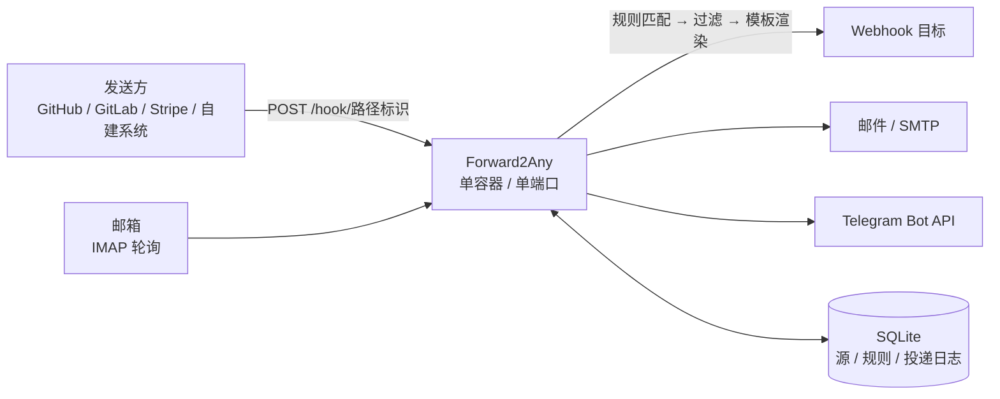

<div align="center">

# Forward2Any

接收 Webhook 与邮件，按规则转发到一个或多个 Webhook / 邮箱 / Telegram。

[](go.mod)
[](Dockerfile)
[](LICENSE)
[](https://github.com/loarland/Forward2Any/stargazers)
[](https://github.com/loarland/Forward2Any/forks)

</div>

## 项目简介

Forward2Any 是一个自托管的**消息转发中继**：把收到的 Webhook 或邮件，按你配置的规则转发到一个或多个
Webhook、邮箱或 Telegram。

它解决的是「同一个事件要通知好几个地方」这件事。CI 的构建结果要进群、要抄送邮箱、还要打到自建系统 ——
与其在每个发送方里配三遍 Webhook，不如让它收一次，剩下的事交给规则。过滤条件决定「要不要转」，
模板决定「转成什么样」，投递日志决定「转出问题了怎么查」。

- **单端口**：后台界面和所有 Webhook 接收端点共用同一个端口，靠路径区分。新增接收源不用开端口，
  也不用改 Docker 配置和防火墙。
- **单二进制**：整个程序（含后台界面）编译成一个静态文件，Docker 镜像约 18MB，
  以 distroless 非 root 运行，前端不引入 npm 构建链。
- **不丢消息**：投递失败按指数退避自动重试，进程重启后自动接管未完成的投递，失败的可手动重放。

适合有自己的 VPS / NAS，想给 CI、监控告警、表单、邮件做一层统一转发的场景。

## 目录

- [特性](#特性)
- [系统架构](#系统架构)
- [快速开始](#快速开始)
- [首次使用](#首次使用)
- [核心概念](#核心概念)
- [源](#源)
- [规则](#规则)
- [投递日志与重试](#投递日志与重试)
- [网络代理](#网络代理)
- [回调地址与单端口](#回调地址与单端口)
- [外观与主题](#外观与主题)
- [环境变量](#环境变量)
- [数据与备份](#数据与备份)
- [安全说明](#安全说明)
- [升级](#升级)
- [常见问题](#常见问题)
- [界面预览](#界面预览)
- [项目结构](#项目结构)
- [开发](#开发)
- [许可证](#许可证)

## 特性

| 模块 | 能力 |
| --- | --- |
| 接收 | Webhook（路径标识 + 密钥 / HMAC-SHA256 签名 / HTTP Basic / IP 白名单）、IMAP 轮询收信 |
| 发送 | Webhook（自定义方法、请求头、报文模板）、SMTP 邮件、Telegram Bot API |
| 规则 | 多接收源 → 多目标源、过滤条件、模板转换、循环检测 |
| 过滤 | `eq` `ne` `gt` `lt` `contains` `not_contains` `exists` `not_exists` `regex` `in`，可视化编辑或文本模式 |
| 模板 | Go template 语法，可改写报文体、邮件主题、请求头；保存前校验语法 |
| 投递 | 指数退避重试、原始报文与渲染结果并排对照、目标响应码与响应体、转发跳链、手动重放 |
| 代理 | HTTP / HTTPS / SOCKS5，全局配置 + 每个源单独勾选 |
| 外观 | 20 种配色 × 亮色 / 深色 / 跟随系统，改完立刻预览 |
| 运维 | 配置导入导出、日志保留期、监听端口热切换、容器健康检查 |
| 安全 | bcrypt 密码、HttpOnly 会话、写操作校验来源、登录失败锁定、Bot Token 脱敏、数据库 0600 |

## 系统架构



数据流：

1. 发送方把事件 POST 到 `/hook/<路径标识>`，或者由程序轮询 IMAP 邮箱把新邮件收进来。
2. 程序按接收源匹配规则，逐个跑过滤条件，命中的才继续。
3. 按模板渲染出实际要发的内容，分发给规则的每一个目标源。
4. 每个目标的每一次转发都独立落一条投递记录，各自重试，互不影响。

## 快速开始

### Docker Compose（推荐）

```bash
git clone https://github.com/loarland/Forward2Any.git
cd Forward2Any

# 建议指定自己的密码和一个外部能访问到的地址
export F2A_ADMIN_PASSWORD="$(openssl rand -base64 18)"
export F2A_BASE_URL="https://hooks.example.com"

docker compose up -d
```

打开 `http://<服务器地址>:16000`，用 `admin` 和你设置的密码登录。

宿主端口被占用时换一个就行，容器内监听的端口不用动：

```bash
export F2A_HOST_PORT=9000
export F2A_BASE_URL="http://<服务器地址>:9000"
docker compose up -d
```

> `F2A_BASE_URL` 很重要：后台显示的回调地址和 curl 示例都按它生成。服务在反向代理后面时，
> 这里要填外部真正的访问地址，而不是 `localhost`。

### 源码运行

需要 Go 1.27 或更高版本：

```bash
go build -o f2a ./cmd/f2a
F2A_ADMIN_PASSWORD="$(openssl rand -base64 18)" ./f2a
```

也可以直接 `go run ./cmd/f2a`。

### 不设置密码会怎样

不提供 `F2A_ADMIN_PASSWORD` 时用的是默认密码 `f2a`，**但它是一次性的**：用它登录后，
后台除「设置」页外的所有页面都会被挡回去，必须先改成新密码才能继续用。
想跳过这一步，启动前用 `F2A_ADMIN_PASSWORD` 指定自己的密码。

## 首次使用

### 登录后台

```text
http://<服务器地址>:16000/
```

| 项目 | 值 |
| --- | --- |
| 用户名 | `admin`（可用 `F2A_ADMIN_USER` 改，也可以在设置页里改） |
| 密码 | `F2A_ADMIN_PASSWORD` 的值；没设置就是 `f2a`，登录后强制修改 |

登录后建议先到「设置」页确认**回调基址**是外部真正能访问到的地址 —— 回调 URL 和 curl 示例都按它生成。

### 建第一条转发

以「GitHub push 通知转发到 Telegram」为例：

1. **源 → 新建源**：类型选 `Webhook`、用途选「接收」，鉴权方式选「固定密钥」并填一串密钥。
   保存后页面上会给出回调地址和一条现成的 curl 命令，带复制按钮。
2. **源 → 新建源**：类型选 `Telegram`、用途选「发送」，填 Bot Token 和 Chat ID。
   Chat ID 的获取方式见 [Telegram 发送](#telegram-发送)。
3. **规则 → 新建规则**：接收源勾上第 1 步的源，目标源勾上第 2 步的源。
   想只转发 push 事件，就加一条过滤条件 `action eq push`。
4. 到 GitHub 仓库的 Webhook 设置里填第 1 步拿到的回调地址。
5. 触发一次事件，到**投递日志**里看结果；也可以直接在源列表上点「发送测试」。

## 核心概念

| 概念 | 说明 |
| --- | --- |
| **源** | 一个消息出入口。类型是 `Webhook`、`邮件` 或 `Telegram`；用途是「接收」「发送」或「两者」。 |
| **规则** | 「哪些源收到的消息 → 转发到哪些源」，外加过滤条件与模板转换。 |
| **投递** | 一次具体的转发动作。每条规则 × 每个目标源 = 一条投递记录，各自重试。 |
| **设置** | 回调基址、管理员账号、监听端口、网络代理、外观、重试策略、日志保留期。 |

规则的两个方向都是多选，所以下面这些不需要额外配置：

```text
Webhook ──┐                    ┌──> Webhook A
          ├── 规则 ────────────┤
邮件    ──┘                    ├──> Webhook B
                               ├──> 邮件
                               └──> Telegram
```

> Telegram 只能当目标（发送）用：Bot API 那头的更新需要主动拉取或另配 Webhook，本项目不做接收。

## 源

「源」页面 → 新建源。表单会按你选的类型和用途，只显示相关的字段。

### Webhook 接收

| 字段 | 说明 |
| --- | --- |
| 路径标识 | 回调地址的最后一段。留空自动生成，带随机后缀，避免被猜。 |
| 鉴权方式 | 见下表。 |
| IP 白名单 | 逗号分隔，支持单个 IP 和 CIDR（`203.0.113.7, 10.0.0.0/8`）。留空不限制。 |

| 鉴权方式 | 怎么校验 |
| --- | --- |
| 不校验 | 谁都能调。只建议在内网使用。 |
| 固定密钥 | 请求头（默认 `X-F2A-Token`）或 URL 参数 `?token=` 里的值必须与密钥一致。 |
| HMAC-SHA256 签名 | 计算 `HMAC-SHA256(密钥, 原始报文)` 的十六进制，与请求头（默认 `X-Hub-Signature-256`，值形如 `sha256=...`）比对，与 GitHub 的做法一致。 |
| HTTP Basic | 请求头名那一栏填用户名，密钥那一栏填密码。 |

保存后页面上会显示完整回调地址和一条 curl 命令，都有复制按钮。

### Webhook 发送

填目标地址、请求方法，以及可选的固定请求头（JSON 对象）。规则里配置了请求头模板时，以模板为准。

### 邮件接收（IMAP 轮询）

填 IMAP 服务器、端口、用户名、密码或授权码、文件夹和轮询间隔。

- 只处理**未读**邮件；处理成功后才标记为已读，失败的下一轮还会重试。
- 轮询间隔小于 10 秒按 60 秒处理（对邮件服务器礼貌一些，也避免被封）。
- 单轮最多处理 50 封，积压的邮件会在后续轮次里慢慢消化。

收进来的邮件会规范化成统一结构，规则里可以这样取：

```json
{
  "from": "a@b.com", "from_name": "张三",
  "to": ["c@d.com"], "cc": [],
  "subject": "构建成功",
  "date": "2026-01-02T15:04:05+08:00",
  "text": "纯文本正文", "html": "HTML 正文",
  "attachments": [{"filename": "log.txt", "content_type": "text/plain", "size": 1234}]
}
```

> 附件只记录文件名、类型和大小，内容不转存。

### 邮件发送（SMTP）

填 SMTP 服务器、端口、加密方式（STARTTLS / SSL / 不加密）、账号密码、发件人和收件人（逗号分隔多个）。

### Telegram 发送

把转发过去的正文当作**一条文本消息**发到指定的群、频道或私聊。填四项：

| 字段 | 说明 |
| --- | --- |
| Bot Token | 找 [@BotFather](https://t.me/BotFather) 建 bot 时给的那串，形如 `123456:ABC-DEF...`。 |
| Chat ID | 群和频道的 id 是**负数**；频道也可以直接填 `@频道用户名`。 |
| 消息话题 ID | 可选，对应 Bot API 的 `message_thread_id`，只在论坛群里想固定发到某个话题时填。 |
| 请求端点 | 默认 `https://api.telegram.org/bot`，自建 Bot API 服务器时才改。 |

**怎么拿 Chat ID**：把 bot 拉进群（频道里要给它管理员权限），在群里发一条消息，然后打开
`<请求端点><Bot Token>/getUpdates`，回复里 `result[].message.chat.id` 就是；私聊得先给 bot 发一条消息。
**话题 ID** 是话题链接 `t.me/c/…/<话题ID>` 里最后那个数字。

请求就是 Bot API 的标准形状：

```bash
curl -X POST 'https://api.telegram.org/bot<token>/sendMessage' \
  -H 'Content-Type: application/json' \
  -d '{"chat_id":-1001234567890,"message_thread_id":42,"text":"hello"}'
```

几点需要知道的：

- **正文超过 4096 个字符直接判失败，不做截断**（按 UTF-16 码元算，这是 Telegram 单条消息的上限）。
  投递日志里会写清楚超了多少，改模板或换目标都行。
- **成不成看返回里的 `ok` 字段，不看 HTTP 状态码**。Bot API 报错也是 `200` + `{"ok":false}`，
  失败时把 `description` 记进日志（比如 `chat not found`）。
- **Bot Token 不会进投递日志**：它在 URL 路径里，所以落库前会把 token 抹成 `***`。
- `api.telegram.org` 在不少网络里直连不到，可以配合[网络代理](#网络代理)使用。

## 规则

「规则」页面 → 新建规则。

### 接收源与目标源

各勾选一个或多个。左侧的源收到消息时触发规则，消息会分发给右侧每一个目标源，每个目标源产生一条
独立的投递记录，各自重试。

两栏都只列**用途对得上的源**：接收源栏只列用途含接收的源，目标源栏只列用途含发送的源；
被藏起来几个会在栏底说明。已经选上的源即使用途改了也仍然留在栏里并注明原因，免得你打开表单随手
一存就把目标悄悄抹掉。源超过 6 个时栏里会出现搜索框，还有「全选 / 清空」。

### 过滤条件

**全部满足**才转发；不添加任何条件表示全部转发。

表单默认是**可视化编辑**：一行一个条件，左边填路径、中间选操作符、右边填值。选到
`exists` / `not_exists` 时值那一格会自动置灰。右上角可以切到**文本模式**，一行一条，适合从别处
整段复制过来，也可以写 `#` 注释：

```text
# 以 # 开头是注释
action eq push
repository.private eq false
commits.0.message contains [skip]
ref exists
```

**路径**用点分隔，纯数字段表示数组下标（`commits.0.id`）。

| 操作符 | 说明 |
| --- | --- |
| `eq` / `ne` | 相等 / 不等。数字按数值比，`true` 是布尔不是字符串。 |
| `gt` / `lt` | 大于 / 小于，按数值比较。 |
| `contains` / `not_contains` | 字符串包含子串，或数组包含某元素。 |
| `exists` / `not_exists` | 字段存在 / 不存在（不需要填值）。 |
| `regex` | 正则匹配。 |
| `in` | 值在给定列表里，例如 `in [push, tag]`。 |

**值**按 JSON 解析，所以这些写法都成立：

```text
count gt 3
private eq false
action in [push, tag]
message regex ^fix:
title eq "带 空格 的标题"
```

裸词（如 `push`）解析不成 JSON，就当作普通字符串；裸词里的连续空格会被合并成一个，要原样保留就用
JSON 字符串。

### 模板转换

留空 = 原样透传入站报文。填了就按 [Go template 语法](https://pkg.go.dev/text/template) 渲染。

| 变量 | 内容 |
| --- | --- |
| `.Payload` | 解析后的 JSON。报文不是 JSON 时退化为 `{"raw": "原始报文"}`。 |
| `.Raw` | 原始报文字符串。 |
| `.Source.name` / `.Source.slug` / `.Source.kind` / `.Source.id` | 接收源信息。 |
| `.Headers` | 入站请求头。 |
| `.TraceID` | 本次入站请求的追踪号。 |
| `.Now` | 当前时间。 |

三类模板：**报文体**（对所有目标生效）、**邮件主题**（只对邮件目标生效，留空则自动生成）、
**请求头**（JSON 对象，值同样支持模板）。

例：把 GitHub push 压成一条消息

```text
{"msg_type":"text","content":{"text":"{{.Payload.repository.full_name}} 收到 {{len .Payload.commits}} 个提交"}}
```

> **模板和过滤器的路径语法不一样。** 过滤器里 `commits.0.id` 是合法的（那是程序自己解析的点路径）；
> 模板用的是 Go template 语法，数组下标必须写成 `{{index .Payload.commits 0}}`。

保存规则时会先校验模板语法，写错了当场报错，不会等到真来了请求才发现。

### 循环转发

转发出去的请求会带上跳链：

```text
X-F2A-Trace: 9f3c1a2b
X-F2A-Hops:  github-push-a1b2,stripe-pay-c3d4
```

接收时如果发现跳链里已经有自己的路径标识，就判定为循环，丢弃并在日志里记一条「已拦截」；
邮件转发同理，跳链写在邮件的 `X-F2A-Hops` 头里。跳链走请求头而不是进程内状态，所以跨实例部署也有效。

## 投递日志与重试

每次转发都会落一条记录，包含入站**原始报文**与实际**渲染后发出的内容**（并排展示，一眼看出模板
改了什么）、出站请求头、目标响应码与响应体、尝试次数、转发跳链和下次重试时间。

```text
pending ──成功──────────────────────> success
   │                                   ▲
   └──失败──> failed ──退避到期后重试───┘
                │
                └──次数用尽──> dead
```

| 状态 | 含义 |
| --- | --- |
| `pending` | 刚入队，还没投过。 |
| `failed` | 投过、失败了，正在退避等待下一次。 |
| `dead` | 重试次数用尽，放弃，可以手动重新投递。 |
| `dropped` | 被循环检测或过滤器拦下，不重试。 |

等待时间按 `退避基数 × 2^(次数-1)` 计算，最长 1 小时；基数和最大次数在「设置」里改。
进程重启后会自动接管上次遗留的待投递记录。失败或已放弃的记录，在详情页点「重新投递」即可重新入队。

日志按「设置」里的保留天数每天自动清理，但**未投递完成的记录不会被清掉**。

## 网络代理

有些目标地址本机直连不到（比如公司网络只放行代理），或者你不想让目标看到本机 IP。

代理是**「设置」里的一个开关 + 「源」上的一个勾选**，两级都要有：

1. **设置 → 网络代理**：选类型（HTTP / HTTPS / SOCKS5 或不使用），填「主机:端口」。
   需要认证就把账号密码写进地址：`用户名:密码@127.0.0.1:7890`。
2. **源 → 发送代理 → 通过代理发送**：勾上。只有勾了的源才走代理，其它源照旧直连。

几点说明：

- 只有用途包含「发送」的源才有这个勾；改成纯接收后转发时会忽略它，改回发送时它还在。
- **邮件发送（SMTP）不走代理** —— HTTP 代理对 SMTP 没有意义，SOCKS 要自己接管连接建立。
- 没配代理时勾选框是禁用的，页面上会直接写明。
- 代理连不上就投递失败，会重试、会进日志，**不会偷偷改回直连**。
- 「HTTPS 代理」指的是到代理这一段用 TLS 连接，不是「用它访问 https 站点」——三种类型都能访问
  https 目标。

## 回调地址与单端口

每建一个接收源就开一个端口更直观，但在容器里做不到：**Docker 的端口映射在容器创建时就固定了**，
防火墙规则同理。所以 Forward2Any 让所有 Webhook 接收源共用一个端口，靠路径区分：

```text
http://<你的域名>:16000/hook/github-push-a1b2
http://<你的域名>:16000/hook/stripe-pay-c3d4
http://<你的域名>:16000/hook/gitlab-merge-e5f6
```

路径标识在保存源时自动生成，也可以自己填。GitHub、GitLab、Stripe、Gitea 以及自建系统都允许回调
URL 带路径，所以这一个端口就够了。

## 外观与主题

「设置 → 外观」里选就行，改完立刻能在页面上预览，保存后对所有浏览器生效：

- **20 种配色**，来自 [Pico CSS](https://picocss.com) 的官方主题，只换主题色，版式不变。
- **亮色 / 深色 / 跟随系统** 三档。选「跟随系统」会跟着操作系统的深色模式走，想固定就选浅色或深色。

## 环境变量

下面这些**只在首次启动时**写入数据库作为引导值，之后一律以后台「设置」里的值为准
（改了环境变量重启也不会覆盖你在界面上改过的值）。

| 变量 | 默认 | 说明 |
| --- | --- | --- |
| `F2A_DATA_DIR` | `./data` | 数据目录，容器里是 `/data` |
| `F2A_PORT` | `16000` | 后台监听端口 |
| `F2A_ADMIN_USER` | `admin` | 管理员用户名 |
| `F2A_ADMIN_PASSWORD` | `f2a` | 不设置就用默认密码，但登录后会被强制要求修改 |
| `F2A_BASE_URL` | `http://localhost:<端口>` | 回调地址与 curl 示例的基址 |
| `F2A_LOG_LEVEL` | `info` | `debug` / `info` / `warn` / `error` |

## 数据与备份

所有数据都在一个 SQLite 文件里：`<数据目录>/f2a.db`（容器内是 `/data/f2a.db`）。

**导出 / 导入**：后台「设置」页可以把所有源与规则导出成 JSON，也可以导入。导入是**整体替换**，
不做合并，所以换机器、改坏了回滚都很方便。导出文件里不含管理员账号、密码哈希和监听端口，
也不含数据库主键（规则通过下标引用源），换一台机器导入不会串号。

**直接备份数据库**：

```bash
# 备份（命名卷 forward2any_f2a-data）
docker run --rm -v forward2any_f2a-data:/data -v "$PWD:/backup" alpine \
  tar czf /backup/f2a-$(date +%F).tar.gz -C /data .

# 恢复
docker run --rm -v forward2any_f2a-data:/data -v "$PWD:/backup" alpine \
  tar xzf /backup/f2a-2026-01-02.tar.gz -C /data
```

想改用宿主机目录（方便直接 backup）就把 compose 里的卷换成 `./data:/data`。容器里的进程是非 root
（uid 65532）运行的，macOS / Windows 的 Docker Desktop 会自动处理权限，**Linux 上需要先把目录交给它**：

```bash
mkdir -p ./data && sudo chown -R 65532:65532 ./data
```

## 安全说明

已经做的：

- **默认密码是一次性的**：用它登录后后台除设置页外全部被挡回，必须改密才能继续用。
- 密码用 bcrypt 存储；会话 token 32 字节随机数，HttpOnly + SameSite=Lax cookie。
- 后台的写操作额外校验 `Origin` / `Referer`（SameSite 之外的双保险）。
- 登录失败 5 次锁定 5 分钟。
- `/hook/...` 接收端点不走会话鉴权（否则发送方没法调），由源自己的密钥 / 签名 / IP 白名单保护；
  未知路径一律 404，不区分「不存在」和「已停用」。
- HMAC 与密钥比对用常量时间比较；入站报文内存读取上限 10MB。
- **数据库文件权限 0600** —— 里面存着 Webhook 密钥、邮箱密码和 Telegram Bot Token。
- 容器以非 root 运行，基础镜像是 distroless（无 shell、无包管理器）。
- **Telegram Bot Token 不会出现在投递日志里**（落库前抹成 `***`）。

需要自己注意的：

- **程序只提供明文 HTTP**，暴露到公网请务必套反向代理上 TLS。
- **IP 白名单校验的是直连对端地址**，不是可以伪造的 `X-Forwarded-For`。放在反向代理后面时，
  白名单要填代理的地址；要按真实客户端 IP 限制，请在代理层做。
- 邮件源如果用「不加密」，密码是明文传输的，仅限可信内网。
- 导出配置文件里**含明文密钥**，别扔进 Git 或公开渠道。

Nginx 反向代理示例：

```nginx
server {
    listen 443 ssl;
    server_name hooks.example.com;

    ssl_certificate     /etc/letsencrypt/live/hooks.example.com/fullchain.pem;
    ssl_certificate_key /etc/letsencrypt/live/hooks.example.com/privkey.pem;

    location / {
        proxy_pass http://127.0.0.1:16000;
        proxy_set_header Host              $host;
        proxy_set_header X-Real-IP         $remote_addr;
        proxy_set_header X-Forwarded-For   $proxy_add_x_forwarded_for;
        proxy_set_header X-Forwarded-Proto $scheme;
    }
}
```

程序会读 `X-Forwarded-Proto`，所以在 HTTPS 后面会把会话 cookie 标成 `Secure`。

## 升级

**Docker**：拉取新代码后重新构建，数据在卷里，不会丢：

```bash
git pull
docker compose up -d --build
```

**源码**：重新 `go build` 覆盖二进制即可。数据库结构变化由程序在启动时自动迁移
（`ALTER TABLE ADD COLUMN` 这类增量迁移），老库直接起来就能用。

改后台监听端口要分两步：容器内那个端口由「设置」页管，改完立即重新绑定、不用重建；
宿主端口映射由 `F2A_HOST_PORT` 管，需要重建容器。容器健康检查会自动读取数据库里的实际端口，
所以改完不需要动 `HEALTHCHECK`。

## 常见问题

### 容器起来了，但宿主访问到的是别的服务

多半是端口撞了。`16000` 可能被别的服务占用，用 `F2A_HOST_PORT` 换一个：

```bash
lsof -nP -iTCP:16000 -sTCP:LISTEN   # 先看看是谁占着
export F2A_HOST_PORT=9000
```

换完记得把「设置 → 回调基址」也一起改，否则生成的回调地址是错的。

### 回调地址里是 `localhost`

回调 URL 按「回调基址」生成，默认是 `http://localhost:<端口>`。到「设置」页把它改成外部真正能访问
到的地址（或者启动时用 `F2A_BASE_URL` 指定），保存后回调地址和 curl 示例都会跟着变。

### 发送方报 404

路径标识写错了。未知路径一律 404，而且**停用的源也是 404**（不区分「不存在」和「已停用」，
免得被拿来探测）。到「源」页面复制回调地址。

### 发送方报 401

鉴权没过：密钥不对、签名算法或请求头名不一致、IP 不在白名单里。注意 HMAC 签名的默认头是
`X-Hub-Signature-256`，值要带 `sha256=` 前缀，签名对象是**原始报文**。

### 邮件源一直没收到

- 只处理**未读**邮件，先确认邮箱里有未读邮件，且 IMAP 文件夹填对了（如 `INBOX`）。
- 轮询间隔小于 10 秒会按 60 秒处理。
- 处理成功才会标记已读，失败的下一轮还会重试；到投递日志里看有没有对应的记录。

### Telegram 报 `chat not found`

Chat ID 不对，或者 bot 不在那个群/频道里。群和频道的 id 是负数，频道也可以填 `@频道用户名`；
频道要先把 bot 设为管理员。

### 正文超过 4096 字符

Telegram 单条消息的上限是 4096 个字符，超了直接判失败、不截断。在规则模板里先截断，或者改用
邮件 / Webhook 目标。

### 忘记后台密码

进容器改数据库即可（容器里没有 shell，用一次性容器带上同一个卷）：

```bash
docker compose down
docker run --rm -it -v forward2any_f2a-data:/data alpine sh
# 容器内：apk add sqlite && sqlite3 /data/f2a.db
#   update settings set value='' where key='admin_pass_hash';  -- 置空哈希
```

> 更省事的办法：先备份 `f2a.db`，再用 `internal/store` 里的密码哈希逻辑生成一个新哈希写回去。
> 如果只是忘了密码且不想折腾，导出配置 → 删掉数据卷重来 → 导入配置，源和规则都在导出文件里。

### 想同时收和发一个 Webhook

把源的用途选成「两者」，它既能当接收源也能当目标源。

## 界面预览

<details>
<summary>亮色</summary>


</details>

<details>
<summary>深色</summary>


</details>

## 项目结构

```text
cmd/f2a/               入口（含容器健康检查子命令）
internal/config/       环境变量与首启动引导
internal/store/        SQLite：建表、迁移、CRUD、配置导入导出
internal/engine/       转发引擎：过滤器、模板渲染、出站 Webhook / SMTP / Telegram、重试 worker
internal/mailin/       IMAP 轮询收信
internal/web/          HTTP 层：后台、登录、接收端点、监听端口生命周期
internal/web/ui/       内嵌的模板与静态资源（htmx、CSS）—— 没有 npm 构建链
scripts/               端到端验证脚本、配色生成脚本
docs/screenshots/      上面「界面预览」用到的截图
Dockerfile             distroless 多阶段构建
docker-compose.yml     推荐部署方式
```

## 开发

```bash
# 单元测试
go test -race ./...

# 本地端到端：真起一个服务 + 一个 mock 接收器 + 一个正向代理，
# 跑完「接收 → 匹配 → 转发 → 落库」整条链路
bash scripts/e2e.sh

# Docker 端到端：镜像构建、非 root 运行、容器健康检查、容器间转发、卷持久化
bash scripts/e2e-docker.sh
```

依赖只有 5 个，都是必需的：纯 Go 的 SQLite 驱动、bcrypt、SMTP 客户端、IMAP 客户端、MIME 解析。
HTTP 路由用标准库 `net/http` 的方法 + 通配符模式，消息体模板用标准库 `text/template`
（沙箱内无 IO 能力，用户填模板是安全的），前端不引框架。

## 许可证

[GPL-3.0](LICENSE)
