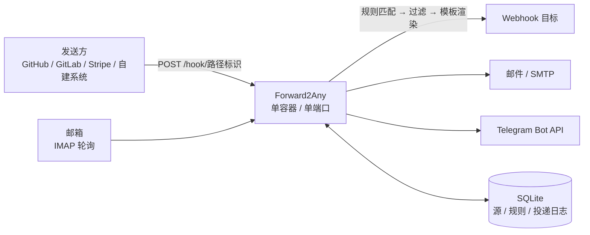

<div align="center">

# Forward2Any

接收 Webhook 与邮件，按规则转发到一个或多个 Webhook / 邮箱 / Telegram。

[](go.mod)
[](Dockerfile)
[](https://github.com/loarland/Forward2Any/actions/workflows/docker.yml)
[](https://github.com/loarland/Forward2Any/releases)
[](LICENSE)
[](https://github.com/loarland/Forward2Any/stargazers)
[](https://github.com/loarland/Forward2Any/forks)

</div>

## 项目简介

Forward2Any 是一个自托管的**消息转发中继**：把收到的 Webhook 或邮件，按你配置的规则转发到一个或多个
Webhook、邮箱或 Telegram。

解决的问题：同一个事件要通知多个地方（CI 结果进群、抄送邮箱、再打到自建系统），
不必在每个发送方各配一遍 Webhook —— 收一次，由规则分发。

- **单端口**：后台界面和所有 Webhook 接收端点共用同一个端口，靠路径区分。新增接收源不用开端口，
  也不用改 Docker 配置和防火墙。
- **单二进制**：整个程序（含后台界面）编译成一个静态文件，Docker 镜像约 18MB，
  基于 distroless，前端不引入 npm 构建链。
- **不丢消息**：投递失败按指数退避自动重试，进程重启后自动接管未完成的投递，失败的可手动重放。

适合有自己的 VPS / NAS，想给 CI、监控告警、表单、邮件做一层统一转发的场景。

## 目录

- [特性](#特性)
- [系统架构](#系统架构)
- [快速开始](#快速开始)
- [二进制部署与 systemd 服务](#二进制部署与-systemd-服务)
- [首次使用](#首次使用)
- [核心概念](#核心概念)
- [源](#源)
- [规则](#规则)
- [投递日志与重试](#投递日志与重试)
- [网络代理](#网络代理)
- [回调地址与单端口](#回调地址与单端口)
- [外观与主题](#外观与主题)
- [环境变量](#环境变量)
- [数据与备份](#数据与备份)
- [安全说明](#安全说明)
- [升级](#升级)
- [常见问题](#常见问题)
- [界面预览](#界面预览)
- [项目结构](#项目结构)
- [开发](#开发)
- [许可证](#许可证)

## 特性

| 模块 | 能力 |
| --- | --- |
| 接收 | Webhook（路径标识 + 密钥 / HMAC-SHA256 签名 / HTTP Basic / IP 白名单）、IMAP 轮询收信 |
| 发送 | Webhook（自定义方法、请求头、报文模板）、SMTP 邮件、Telegram Bot API |
| 规则 | 多接收源 → 多目标源、过滤条件、模板转换、循环检测 |
| 过滤 | `eq` `ne` `gt` `lt` `contains` `not_contains` `exists` `not_exists` `regex` `in`，可视化编辑或文本模式 |
| 模板 | Go template 语法，可改写报文体、邮件主题、请求头；保存前校验语法 |
| 投递 | 指数退避重试、原始报文与渲染结果并排对照、目标响应码与响应体、转发跳链、手动重放 |
| 代理 | HTTP / HTTPS / SOCKS5，全局配置 + 每个源单独勾选 |
| 外观 | 20 种配色 × 亮色 / 深色 / 跟随系统，改完立刻预览 |
| 运维 | 配置导入导出、日志保留期、监听端口热切换、容器健康检查 |
| 安全 | bcrypt 密码、HttpOnly 会话、写操作校验来源、登录失败锁定、Bot Token 脱敏、数据库 0600 |

## 系统架构



数据流：

1. 发送方把事件 POST 到 `/hook/<路径标识>`，或者由程序轮询 IMAP 邮箱把新邮件收进来。
2. 程序按接收源匹配规则，逐个跑过滤条件，命中的才继续。
3. 按模板渲染出实际要发的内容，分发给规则的每一个目标源。
4. 每个目标的每一次转发都独立落一条投递记录，各自重试，互不影响。

## 快速开始

### 方式一：一键脚本（推荐，Linux + systemd）

干净的 Linux 服务器上一条命令：下载发布包、校验 sha256、装二进制、建系统用户与数据目录、
写 systemd 单元、启动并等健康检查通过。

```bash
curl -fsSL https://raw.githubusercontent.com/loarland/Forward2Any/main/scripts/install.sh | sudo bash
```

跑完会打印后台地址和管理员密码。先看脚本再跑：

```bash
curl -fsSLO https://raw.githubusercontent.com/loarland/Forward2Any/main/scripts/install.sh
sudo bash install.sh
```

首次安装可以按自己的情况覆盖这些（都会写进 `/etc/forward2any.env`）：

```bash
sudo F2A_PORT=9000 \
     F2A_BASE_URL="https://hooks.example.com" \
     F2A_ADMIN_PASSWORD="换成一个强密码" \
     bash install.sh
```

之后升级、看状态、卸载：

```bash
sudo bash install.sh upgrade              # 只换二进制和单元文件，数据和配置不动
sudo bash install.sh status               # 版本 + systemd 状态 + 健康检查
sudo bash install.sh uninstall            # 停服务、删单元和二进制，保留数据
sudo bash install.sh uninstall --purge    # 连数据一起删
```

细节（装了哪些文件、怎么改端口、怎么备份）见[二进制部署与 systemd 服务](#二进制部署与-systemd-服务)。

### 方式二：Docker Compose（拉现成镜像）

镜像由 GitHub Actions 自动构建并推到 GHCR，`linux/amd64` 和 `linux/arm64` 都有，
服务器上不用 clone 代码、也不用装 Go：

```bash
git clone https://github.com/loarland/Forward2Any.git
cd Forward2Any

cp .env.example .env     # 端口、回调地址、管理员密码都在这里改；不改也能直接起
docker compose up -d
```

`.env.example` 里每一项都有注释，常用的几项：`F2A_HOST_PORT`（宿主端口）、`F2A_BASE_URL`
（回调基址）、`F2A_ADMIN_PASSWORD`、`F2A_DATA_DIR`（数据目录）、`F2A_UID` / `F2A_GID`
（容器进程身份，默认 `0`，见[数据与备份](#数据与备份)）。

`docker-compose.yml` 默认用 `image: ghcr.io/loarland/forward2any:latest`（先拉再起）。
不 clone 仓库的话直接 `docker run`：

```bash
docker run -d --name forward2any --restart unless-stopped \
  -p 16000:16000 \
  -v f2a-data:/data \
  -e F2A_BASE_URL="https://hooks.example.com" \
  -e F2A_ADMIN_PASSWORD="$(openssl rand -base64 18)" \
  ghcr.io/loarland/forward2any:latest
```

数据都在 `f2a-data` 这个卷里，容器删了重建也不丢；想在宿主机上直接看到文件见[数据与备份](#数据与备份)。

| 镜像标签 | 什么时候更新 |
| --- | --- |
| `latest` / `main` | 每次推送到 main |
| `sha-b0708c0` | 对应某一次提交，想固定版本就用它 |
| `1.0.3` / `1.0` | 仓库打了 `v1.0.3` 这样的标签时 |

想自己在本地从源码构建（改了代码要验证），把 compose 里的 `image:` 那行换成 `build: .` 即可。

宿主端口被占用时换一个，容器内监听的端口不用动 —— 在 `.env` 里改 `F2A_HOST_PORT`，
或者在命令行上临时覆盖（命令行优先）：

```bash
F2A_HOST_PORT=9000 docker compose up -d
```

`F2A_BASE_URL` 没显式设过的话会跟着端口一起变，不用另外改。

> 镜像公开，`docker pull` 不需要登录。国内直连 `ghcr.io` 可能不稳，可配镜像加速或改用方式一。

> `F2A_BASE_URL` 很重要：后台显示的回调地址和 curl 示例都按它生成。服务在反向代理后面时，
> 这里要填外部真正的访问地址，而不是 `localhost`。

### 方式三：源码运行

需要 Go 1.27 或更高版本：

```bash
go build -o f2a ./cmd/f2a
F2A_ADMIN_PASSWORD="$(openssl rand -base64 18)" ./f2a
```

也可以直接 `go run ./cmd/f2a`。

### 不设置密码会怎样

不提供 `F2A_ADMIN_PASSWORD` 时用的是默认密码 `f2a`，**但它是一次性的**：用它登录后，
后台除「设置」页外的所有页面都会被挡回去，必须先改成新密码才能继续用。
想跳过这一步，启动前用 `F2A_ADMIN_PASSWORD` 指定自己的密码。

## 二进制部署与 systemd 服务

不想用 Docker 就直接跑二进制。发布包静态编译（`CGO_ENABLED=0`），不依赖 glibc，Alpine 也能跑。

一键脚本落地的东西都在这几个路径上，手动装也按同一套约定来：

| 东西 | 路径 |
| --- | --- |
| 二进制 | `/usr/local/bin/f2a` |
| 数据目录 | `/var/lib/forward2any`（SQLite 库在里面，权限 0700、属主 `f2a`） |
| 环境变量 | `/etc/forward2any.env`（0600，只在首次启动时作为引导值） |
| systemd 单元 | `/etc/systemd/system/forward2any.service` |
| 运行用户 | `f2a`（系统用户，没有登录 shell） |
| 许可原文 | `/usr/local/share/doc/forward2any/LICENSE`（Apache-2.0 要求随分发附带） |

### 手动安装

每个发布包（`forward2any_<版本>_linux_<架构>.tar.gz`）里就是二进制、systemd 单元和 LICENSE：

```bash
ver=1.0.3        # 换成你要的版本；amd64 / arm64 按机器选
base="https://github.com/loarland/Forward2Any/releases/download/v${ver}"
curl -fsSLO "${base}/forward2any_${ver}_linux_amd64.tar.gz"
curl -fsSLO "${base}/checksums.txt"
sha256sum -c --ignore-missing checksums.txt      # 建议校验一下
tar -xzf "forward2any_${ver}_linux_amd64.tar.gz"
cd "forward2any_${ver}_linux_amd64"

sudo install -m 0755 f2a /usr/local/bin/f2a
nologin=$(command -v nologin || echo /bin/false)
sudo useradd --system --no-create-home --home-dir /var/lib/forward2any --shell "$nologin" f2a
sudo install -d -m 0700 -o f2a -g f2a /var/lib/forward2any
sudo install -m 0644 forward2any.service /etc/systemd/system/forward2any.service

# 首次启动的引导值都放这里（0600，里面有密码）
sudo install -m 0600 -o root -g root /dev/stdin /etc/forward2any.env <<'EOF'
F2A_DATA_DIR=/var/lib/forward2any
F2A_PORT=16000
F2A_ADMIN_USER=admin
F2A_BASE_URL=https://hooks.example.com
F2A_LOG_LEVEL=info
F2A_ADMIN_PASSWORD=换成你自己的强密码
EOF

sudo systemctl daemon-reload
sudo systemctl enable --now forward2any
f2a version                                      # 确认装上的是哪个版本
curl -fsS http://127.0.0.1:16000/healthz         # 探活，返回 ok 就对了
```

> 用二进制自带的探活（`f2a healthcheck`，按数据库里的实际端口探）要**以服务用户身份**跑：
> `sudo -u f2a env F2A_DATA_DIR=/var/lib/forward2any f2a healthcheck` ——
> root 跑会在数据目录留下 root 属主的 `-wal`/`-shm`，服务反而打不开库。

> `F2A_BASE_URL` 必须填外部能访问到的地址（域名或公网 IP）：回调 URL 和 curl 示例都按它生成，
> 留 `localhost` 的话发给 GitHub / Stripe 无效。

### 平时怎么管

```bash
systemctl status forward2any                    # 状态
journalctl -u forward2any -f                    # 跟日志（启动失败也看这里）
sudo systemctl restart forward2any              # 重启
sudo systemctl stop forward2any                 # 停
sudo bash install.sh upgrade                    # 升级（= 重跑一键脚本，数据和配置不动）
curl -fsS http://127.0.0.1:16000/healthz        # 探活
```

### 单元文件里做了什么

单元文件在仓库里：`deploy/forward2any.service`。要点：

- `Restart=always`，`KillSignal=SIGTERM`：收到 SIGTERM 会优雅关闭，**没投完的记录留在库里**、
  下次启动接着投。别用 `kill -9`。
- 加固：`NoNewPrivileges`、`ProtectSystem=strict`、`ProtectHome`、`PrivateTmp`、`PrivateDevices`、
  空 `CapabilityBoundingSet`、`RestrictAddressFamilies`、`SystemCallFilter=@system-service`、
  `MemoryDenyWriteExecute`。它能写的地方只有自己的数据目录。
- `ReadWritePaths=/var/lib/forward2any`：数据目录换到别处时这一行要跟着改（一键脚本会自动改）。
- 端口小于 1024 需要 `AmbientCapabilities=CAP_NET_BIND_SERVICE`（一键脚本会自动加上；
  默认的 16000 不需要）。
- `UMask=0077`：库文件是 0600 —— 里面存着 webhook 密钥、邮箱密码和 Telegram Bot Token。

### 改端口 / 改密码

`/etc/forward2any.env` 里那些值**只在首次启动时**写进数据库，之后一律以后台「设置」页为准。
所以：

- 换端口到后台「设置」页改（立即重新绑定，不用重启服务），防火墙 / 反向代理 / `F2A_BASE_URL`
  同步改。
- 想改管理员密码，用后台「设置 → 管理员账号」，不是改环境变量文件。
  忘了密码见[常见问题](#忘记后台密码)。

### 卸载

```bash
sudo bash install.sh uninstall            # 停服务、删单元和二进制，数据保留
sudo bash install.sh uninstall --purge    # 连数据目录、环境变量文件和系统用户一起删
```

手动装的就把上面的步骤倒着做一遍：`systemctl disable --now forward2any`、
删掉单元文件和 `/usr/local/bin/f2a`、`systemctl daemon-reload`。

## 首次使用

### 登录后台

```text
http://<服务器地址>:16000/
```

| 项目 | 值 |
| --- | --- |
| 用户名 | `admin`（可用 `F2A_ADMIN_USER` 改，也可以在设置页里改） |
| 密码 | `F2A_ADMIN_PASSWORD` 的值；没设置就是 `f2a`，登录后强制修改 |

登录后建议先到「设置」页确认**回调基址**是外部真正能访问到的地址 —— 回调 URL 和 curl 示例都按它生成。

### 建第一条转发

以「GitHub push 通知转发到 Telegram」为例：

1. **源 → 新建源**：类型选 `Webhook`、用途选「接收」，鉴权方式选「固定密钥」并填一串密钥。
   保存后页面上会给出回调地址和一条现成的 curl 命令，带复制按钮。
2. **源 → 新建源**：类型选 `Telegram`、用途选「发送」，填 Bot Token 和 Chat ID。
   Chat ID 的获取方式见 [Telegram 发送](#telegram-发送)。
3. **规则 → 新建规则**：接收源勾上第 1 步的源，目标源勾上第 2 步的源。
   想只转发 push 事件，就加一条过滤条件 `action eq push`。
4. 到 GitHub 仓库的 Webhook 设置里填第 1 步拿到的回调地址。
5. 触发一次事件，到**投递日志**里看结果；也可以直接在源列表上点「发送测试」。

## 核心概念

| 概念 | 说明 |
| --- | --- |
| **源** | 一个消息出入口。类型是 `Webhook`、`邮件` 或 `Telegram`；用途是「接收」「发送」或「两者」。 |
| **规则** | 「哪些源收到的消息 → 转发到哪些源」，外加过滤条件与模板转换。 |
| **投递** | 一次具体的转发动作。每条规则 × 每个目标源 = 一条投递记录，各自重试。 |
| **设置** | 回调基址、管理员账号、监听端口、信任的 Origin / Referer、网络代理、外观、重试策略、日志保留期。 |

规则的两个方向都是多选，所以下面这些不需要额外配置：

```text
Webhook ──┐                    ┌──> Webhook A
          ├── 规则 ────────────┤
邮件    ──┘                    ├──> Webhook B
                               ├──> 邮件
                               └──> Telegram
```

> Telegram 只能当目标（发送）用：Bot API 那头的更新需要主动拉取或另配 Webhook，本项目不做接收。

## 源

「源」页面 → 新建源。表单会按你选的类型和用途，只显示相关的字段。

### Webhook 接收

| 字段 | 说明 |
| --- | --- |
| 路径标识 | 回调地址的最后一段。留空自动生成，带随机后缀，避免被猜。 |
| 鉴权方式 | 见下表。 |
| IP 白名单 | 逗号分隔，支持单个 IP 和 CIDR（`203.0.113.7, 10.0.0.0/8`）。留空不限制。 |

| 鉴权方式 | 怎么校验 |
| --- | --- |
| 不校验 | 谁都能调。只建议在内网使用。 |
| 固定密钥 | 请求头（默认 `X-F2A-Token`）或 URL 参数 `?token=` 里的值必须与密钥一致。 |
| HMAC-SHA256 签名 | 计算 `HMAC-SHA256(密钥, 原始报文)` 的十六进制，与请求头（默认 `X-Hub-Signature-256`，值形如 `sha256=...`）比对，与 GitHub 的做法一致。 |
| HTTP Basic | 请求头名那一栏填用户名，密钥那一栏填密码。 |

保存后页面上会显示完整回调地址和一条 curl 命令，都有复制按钮。

### Webhook 发送

填目标地址、请求方法，以及可选的固定请求头（JSON 对象）。规则里配置了请求头模板时，以模板为准。

### 邮件接收（IMAP 轮询）

填 IMAP 服务器、端口、用户名、密码或授权码、文件夹和轮询间隔。

- 只处理**未读**邮件；处理成功后才标记为已读，失败的下一轮还会重试。
- 轮询间隔小于 10 秒按 60 秒处理（对邮件服务器礼貌一些，也避免被封）。
- 单轮最多处理 50 封，积压的邮件会在后续轮次里慢慢消化。

收进来的邮件会规范化成统一结构，规则里可以这样取：

```json
{
  "from": "a@b.com", "from_name": "张三",
  "to": ["c@d.com"], "cc": [],
  "subject": "构建成功",
  "date": "2026-01-02T15:04:05+08:00",
  "text": "纯文本正文", "html": "HTML 正文",
  "attachments": [{"filename": "log.txt", "content_type": "text/plain", "size": 1234}]
}
```

> 附件只记录文件名、类型和大小，内容不转存。

### 邮件发送（SMTP）

填 SMTP 服务器、端口、加密方式（STARTTLS / SSL / 不加密）、账号密码、发件人和收件人（逗号分隔多个）。

### Telegram 发送

把转发过去的正文当作**一条文本消息**发到指定的群、频道或私聊。填四项：

| 字段 | 说明 |
| --- | --- |
| Bot Token | 找 [@BotFather](https://t.me/BotFather) 建 bot 时给的那串，形如 `123456:ABC-DEF...`。 |
| Chat ID | 群和频道的 id 是**负数**；频道也可以直接填 `@频道用户名`。 |
| 消息话题 ID | 可选，对应 Bot API 的 `message_thread_id`，只在论坛群里想固定发到某个话题时填。 |
| 请求端点 | 默认 `https://api.telegram.org/bot`，自建 Bot API 服务器时才改。 |

**怎么拿 Chat ID**：把 bot 拉进群（频道里要给它管理员权限），在群里发一条消息，然后打开
`<请求端点><Bot Token>/getUpdates`，回复里 `result[].message.chat.id` 就是；私聊得先给 bot 发一条消息。
**话题 ID** 是话题链接 `t.me/c/…/<话题ID>` 里最后那个数字。

请求就是 Bot API 的标准形状：

```bash
curl -X POST 'https://api.telegram.org/bot<token>/sendMessage' \
  -H 'Content-Type: application/json' \
  -d '{"chat_id":-1001234567890,"message_thread_id":42,"text":"hello"}'
```

几点需要知道的：

- **正文超过 4096 个字符直接判失败，不做截断**（按 UTF-16 码元算，这是 Telegram 单条消息的上限）。
  投递日志里会写清楚超了多少，改模板或换目标都行。
- **成不成看返回里的 `ok` 字段，不看 HTTP 状态码**。Bot API 报错也是 `200` + `{"ok":false}`，
  失败时把 `description` 记进日志（比如 `chat not found`）。
- **Bot Token 不会进投递日志**：它在 URL 路径里，所以落库前会把 token 抹成 `***`。
- `api.telegram.org` 在不少网络里直连不到，可以配合[网络代理](#网络代理)使用。

## 规则

「规则」页面 → 新建规则。

### 接收源与目标源

各勾选一个或多个。左侧的源收到消息时触发规则，消息会分发给右侧每一个目标源，每个目标源产生一条
独立的投递记录，各自重试。

两栏都只列**用途对得上的源**：接收源栏只列用途含接收的源，目标源栏只列用途含发送的源；
被藏起来的会在栏底说明。已经选上的源即使用途改了也留在栏里并注明原因，
否则打开表单保存一次就会抹掉这个目标。源超过 6 个时栏里会出现搜索框，还有「全选 / 清空」。

### 过滤条件

**全部满足**才转发；不添加任何条件表示全部转发。

表单默认是**可视化编辑**：一行一个条件，左边填路径、中间选操作符、右边填值。选到
`exists` / `not_exists` 时值那一格会自动置灰。右上角可以切到**文本模式**，一行一条，适合从别处
整段复制过来，也可以写 `#` 注释：

```text
# 以 # 开头是注释
action eq push
repository.private eq false
commits.0.message contains [skip]
ref exists
```

**路径**用点分隔，纯数字段表示数组下标（`commits.0.id`）。

| 操作符 | 说明 |
| --- | --- |
| `eq` / `ne` | 相等 / 不等。数字按数值比，`true` 是布尔不是字符串。 |
| `gt` / `lt` | 大于 / 小于，按数值比较。 |
| `contains` / `not_contains` | 字符串包含子串，或数组包含某元素。 |
| `exists` / `not_exists` | 字段存在 / 不存在（不需要填值）。 |
| `regex` | 正则匹配。 |
| `in` | 值在给定列表里，例如 `in [push, tag]`。 |

**值**按 JSON 解析，所以这些写法都成立：

```text
count gt 3
private eq false
action in [push, tag]
message regex ^fix:
title eq "带 空格 的标题"
```

裸词（如 `push`）解析不成 JSON，就当作普通字符串；裸词里的连续空格会被合并成一个，要原样保留就用
JSON 字符串。

### 模板转换

留空 = 原样透传入站报文。填了就按 [Go template 语法](https://pkg.go.dev/text/template) 渲染。

| 变量 | 内容 |
| --- | --- |
| `.Payload` | 解析后的 JSON。报文不是 JSON 时退化为 `{"raw": "原始报文"}`。 |
| `.Raw` | 原始报文字符串。 |
| `.Source.name` / `.Source.slug` / `.Source.kind` / `.Source.id` | 接收源信息。 |
| `.Headers` | 入站请求头。 |
| `.TraceID` | 本次入站请求的追踪号。 |
| `.Now` | 当前时间。 |

三类模板：**报文体**（对所有目标生效）、**邮件主题**（只对邮件目标生效，留空则自动生成）、
**请求头**（JSON 对象，值同样支持模板）。

例：把 GitHub push 压成一条消息

```text
{"msg_type":"text","content":{"text":"{{.Payload.repository.full_name}} 收到 {{len .Payload.commits}} 个提交"}}
```

> **模板和过滤器的路径语法不一样。** 过滤器里 `commits.0.id` 是合法的（那是程序自己解析的点路径）；
> 模板用的是 Go template 语法，数组下标必须写成 `{{index .Payload.commits 0}}`。

保存规则时会先校验模板语法，写错了当场报错，不会等到真来了请求才发现。

### 循环转发

转发出去的请求会带上跳链：

```text
X-F2A-Trace: 9f3c1a2b
X-F2A-Hops:  github-push-a1b2,stripe-pay-c3d4
```

接收时如果发现跳链里已经有自己的路径标识，就判定为循环，丢弃并在日志里记一条「已拦截」；
邮件转发同理，跳链写在邮件的 `X-F2A-Hops` 头里。跳链走请求头而不是进程内状态，所以跨实例部署也有效。

## 投递日志与重试

每次转发都会落一条记录，包含入站**原始报文**与实际**渲染后发出的内容**（并排展示，一眼看出模板
改了什么）、出站请求头、目标响应码与响应体、尝试次数、转发跳链和下次重试时间。

```text
pending ──成功──────────────────────> success
   │                                   ▲
   └──失败──> failed ──退避到期后重试───┘
                │
                └──次数用尽──> dead
```

| 状态 | 含义 |
| --- | --- |
| `pending` | 刚入队，还没投过。 |
| `failed` | 投过、失败了，正在退避等待下一次。 |
| `dead` | 重试次数用尽，放弃，可以手动重新投递。 |
| `dropped` | 被循环检测或过滤器拦下，不重试。 |

等待时间按 `退避基数 × 2^(次数-1)` 计算，最长 1 小时；基数和最大次数在「设置」里改。
进程重启后会自动接管上次遗留的待投递记录。失败或已放弃的记录，在详情页点「重新投递」即可重新入队。

日志按「设置」里的保留天数每天自动清理，但**未投递完成的记录不会被清掉**。

## 网络代理

有些目标地址本机直连不到（比如公司网络只放行代理），或者你不想让目标看到本机 IP。

代理是**「设置」里的一个开关 + 「源」上的一个勾选**，两级都要有：

1. **设置 → 网络代理**：选类型（HTTP / HTTPS / SOCKS5 或不使用），填「主机:端口」。
   需要认证就把账号密码写进地址：`用户名:密码@127.0.0.1:7890`。
2. **源 → 发送代理 → 通过代理发送**：勾上。只有勾了的源才走代理，其它源照旧直连。

几点说明：

- 只有用途包含「发送」的源才有这个勾；改成纯接收后转发时会忽略它，改回发送时它还在。
- **邮件发送（SMTP）不走代理** —— HTTP 代理对 SMTP 没有意义，SOCKS 要自己接管连接建立。
- 没配代理时勾选框是禁用的，页面上会直接写明。
- 代理连不上就投递失败，会重试、会进日志，**不会偷偷改回直连**。
- 「HTTPS 代理」指的是到代理这一段用 TLS 连接，不是「用它访问 https 站点」——三种类型都能访问
  https 目标。

## 回调地址与单端口

每建一个接收源就开一个端口更直观，但在容器里做不到：**Docker 的端口映射在容器创建时就固定了**，
防火墙规则同理。所以 Forward2Any 让所有 Webhook 接收源共用一个端口，靠路径区分：

```text
http://<你的域名>:16000/hook/github-push-a1b2
http://<你的域名>:16000/hook/stripe-pay-c3d4
http://<你的域名>:16000/hook/gitlab-merge-e5f6
```

路径标识在保存源时自动生成，也可以自己填。GitHub、GitLab、Stripe、Gitea 以及自建系统都允许回调
URL 带路径，所以这一个端口就够了。

## 外观与主题

「设置 → 外观」里选就行，改完立刻能在页面上预览，保存后对所有浏览器生效：

- **20 种配色**，来自 [Pico CSS](https://picocss.com) 的官方主题，只换主题色，版式不变。
- **亮色 / 深色 / 跟随系统** 三档。选「跟随系统」会跟着操作系统的深色模式走，想固定就选浅色或深色。

## 环境变量

下面这些**只在首次启动时**写入数据库作为引导值，之后一律以后台「设置」里的值为准
（改了环境变量重启也不会覆盖你在界面上改过的值）。

怎么给：Docker 用 `docker-compose.yml` 或 `docker run -e`；一键脚本装的写在
`/etc/forward2any.env`（systemd 通过 `EnvironmentFile` 读它），改完 `systemctl restart forward2any`。

| 变量 | 默认 | 说明 |
| --- | --- | --- |
| `F2A_DATA_DIR` | `./data` | 数据目录，容器里是 `/data` |
| `F2A_PORT` | `16000` | 后台监听端口 |
| `F2A_ADMIN_USER` | `admin` | 管理员用户名 |
| `F2A_ADMIN_PASSWORD` | `f2a` | 不设置就用默认密码，但登录后会被强制要求修改 |
| `F2A_BASE_URL` | `http://localhost:<端口>` | 回调地址与 curl 示例的基址 |
| `F2A_LOG_LEVEL` | `info` | `debug` / `info` / `warn` / `error` |

compose 的 `.env` 里还有几个**只有 docker-compose.yml 用**的项，进程读不到它们：
`F2A_HOST_PORT`（映射到宿主机哪个端口）、`F2A_DATA_DIR`（挂哪个卷或目录，容器里始终是 `/data`）、
`F2A_UID` / `F2A_GID`（容器进程身份，默认 `0`）。

## 数据与备份

所有数据都在一个 SQLite 文件里：`<数据目录>/f2a.db`。

| 装法 | 数据文件 |
| --- | --- |
| 一键脚本 / 手动装二进制 | `/var/lib/forward2any/f2a.db` |
| Docker（命名卷 `f2a-data`） | 容器内 `/data/f2a.db` |
| Docker（`F2A_DATA_DIR=./data`） | 仓库目录下的 `./data/f2a.db` |
| 源码直接跑 | `./data/f2a.db`（可用 `F2A_DATA_DIR` 改） |

**导出 / 导入**：后台「设置」页可以把所有源与规则导出成 JSON，也可以导入；导入是**整体替换**，
不做合并。导出文件不含管理员账号、密码哈希和监听端口，也不含数据库主键（规则通过下标引用源），
换一台机器导入不会串号。

**Docker 换宿主机目录**：默认的命名卷要再挂一次容器才看得到，想在宿主机上直接看到文件就在
`.env` 里设 `F2A_DATA_DIR=./data`，然后 `docker compose up -d`。容器默认以 root 跑，宿主目录
不需要先 `chown`；**数据文件属主也是 root**，Linux 上直接 `cat` / `tar` 要 sudo。

想让数据文件归自己（备份不用 sudo）就在 `.env` 里填自己的 uid / gid，目录也由自己创建：

```bash
mkdir -p ./data
printf 'F2A_UID=%s\nF2A_GID=%s\n' "$(id -u)" "$(id -g)" >> .env
docker compose up -d
```

> 用命名卷跑非 root 的话要先把卷交给它：
> `docker run --rm -v forward2any_f2a-data:/data alpine chown -R <uid>:<gid> /data`。

**直接备份数据库**：

```bash
# 命名卷 forward2any_f2a-data（默认）
docker run --rm -v forward2any_f2a-data:/data -v "$PWD:/backup" alpine \
  tar czf /backup/f2a-$(date +%F).tar.gz -C /data .

# 恢复
docker run --rm -v forward2any_f2a-data:/data -v "$PWD:/backup" alpine \
  tar xzf /backup/f2a-2026-01-02.tar.gz -C /data

# 宿主机目录（F2A_DATA_DIR=./data），数据文件属主是 root
sudo tar czf f2a-$(date +%F).tar.gz -C ./data .
```

> 想以非 root 跑：compose 用 `.env` 里的 `F2A_UID` / `F2A_GID`，`docker run` 用
> `--user "$(id -u):$(id -g)"`。两种方式都要求数据目录属主跟它一致。

## 安全说明

已经做的：

- **默认密码是一次性的**：用它登录后后台除设置页外全部被挡回，必须改密才能继续用。
- 密码用 bcrypt 存储；会话 token 32 字节随机数，HttpOnly + SameSite=Lax cookie。
- 后台的写操作额外校验 `Origin` / `Referer`（SameSite 之外的双保险）。认可的范围：同源请求、「回调基址」的
  主机名、设置页「信任的 Origin / Referer」里列出的地址；两个头都不带的请求（curl、脚本）不校验。
- 登录失败 5 次锁定 5 分钟。
- `/hook/...` 接收端点不走会话鉴权（否则发送方没法调），由源自己的密钥 / 签名 / IP 白名单保护；
  未知路径一律 404，不区分「不存在」和「已停用」。
- HMAC 与密钥比对用常量时间比较；入站报文内存读取上限 10MB。
- **数据库文件权限 0600** —— 里面存着 Webhook 密钥、邮箱密码和 Telegram Bot Token。
- 基础镜像是 distroless（无 shell、无包管理器）；一键脚本 / 手动装二进制的以专用用户 `f2a` 运行。
- **Telegram Bot Token 不会出现在投递日志里**（落库前抹成 `***`）。

需要自己注意的：

- **Docker 镜像默认以 root 运行**，数据文件也归 root。不想这样的话把 compose 的 `.env` 里
  `F2A_UID` / `F2A_GID` 设成非 0（`docker run` 用 `--user`），并保证数据目录属主与它一致。
- **程序只提供明文 HTTP**，暴露到公网请务必套反向代理上 TLS。
- **IP 白名单校验的是直连对端地址**，不是可以伪造的 `X-Forwarded-For`。放在反向代理后面时，
  白名单要填代理的地址；要按真实客户端 IP 限制，请在代理层做。
- 邮件源如果用「不加密」，密码是明文传输的，仅限可信内网。
- 导出配置文件里**含明文密钥**，别扔进 Git 或公开渠道。

Nginx 反向代理示例：

```nginx
server {
    listen 443 ssl;
    server_name hooks.example.com;

    ssl_certificate     /etc/letsencrypt/live/hooks.example.com/fullchain.pem;
    ssl_certificate_key /etc/letsencrypt/live/hooks.example.com/privkey.pem;

    location / {
        proxy_pass http://127.0.0.1:16000;
        proxy_set_header Host              $http_host;   # 原样转发，保留端口（$host 会去掉端口）
        proxy_set_header X-Real-IP         $remote_addr;
        proxy_set_header X-Forwarded-For   $proxy_add_x_forwarded_for;
        proxy_set_header X-Forwarded-Proto $scheme;
    }
}
```

程序会读 `X-Forwarded-Proto`，所以在 HTTPS 后面会把会话 cookie 标成 `Secure`。

## 升级

**脚本装的（二进制 + systemd）**：重跑一键脚本即升级：下载新版本、校验、替换二进制与单元文件、
重启并等健康检查通过；环境变量文件与数据不动。

```bash
sudo bash install.sh upgrade
# 或者指定版本：sudo F2A_VERSION=1.2.3 bash install.sh upgrade
```

回滚就是 `sudo F2A_VERSION=<上一个版本> bash install.sh upgrade`。

**用现成镜像**：拉新的 `latest` 再重建容器，数据都在命名卷里，重建不会丢：

```bash
docker rm -f forward2any
docker run -d --name forward2any --restart unless-stopped \
  -p 16000:16000 -v f2a-data:/data \
  -e F2A_BASE_URL="https://hooks.example.com" \
  ghcr.io/loarland/forward2any:latest
```

用 compose 的话一条命令就够：`docker compose pull && docker compose up -d`。
想固定版本就把 `latest` 换成 `1.0.3` / `1.0` 或 `sha-b0708c0` 这样的标签，要升级时再手动改。

**从源码构建**：拉取新代码后重新构建：

```bash
git pull
docker compose up -d --build
```

**源码**：重新 `go build` 覆盖二进制即可。数据库结构变化由程序在启动时自动迁移
（`ALTER TABLE ADD COLUMN` 这类增量迁移），老库直接起来就能用。

改后台监听端口要分两步：容器内那个端口由「设置」页管，改完立即重新绑定、不用重建；
宿主端口映射由 `F2A_HOST_PORT` 管，需要重建容器。容器健康检查会自动读取数据库里的实际端口，
所以改完不需要动 `HEALTHCHECK`。

## 常见问题

### 容器起来了，但宿主访问到的是别的服务

通常是端口冲突。`16000` 被占用时在 `.env` 里改 `F2A_HOST_PORT`（或临时覆盖）：

```bash
lsof -nP -iTCP:16000 -sTCP:LISTEN   # 先看看是谁占着
F2A_HOST_PORT=9000 docker compose up -d
```

换完记得把「设置 → 回调基址」也一起改，否则生成的回调地址是错的。`F2A_BASE_URL`
只在首次启动时作为引导值写进数据库，之前存过的话改环境变量不会覆盖它。

### 回调地址里是 `localhost`

回调 URL 按「回调基址」生成，默认是 `http://localhost:<端口>`。到「设置」页把它改成外部真正能访问
到的地址（或者启动时用 `F2A_BASE_URL` 指定），保存后回调地址和 curl 示例都会跟着变。

### 反向代理后面报「跨站请求被拒绝」

后台的写操作（登录、保存设置等）会拿请求的 `Origin`（没有就看 `Referer`）跟「本服务看到的地址」比，
不一致就 403 —— 防的是别的站点伪造请求。用 `IP:端口` 直接访问时两边天然一致；反向代理常常把 Host
改成上游地址（nginx 不写 `proxy_set_header Host` 时就是 `127.0.0.1:16000`），域名来的请求就被挡下了。

任选一种解决：

1. 让代理转发原始 Host：nginx 写 `proxy_set_header Host $http_host;`（`$host` 会去掉端口，非标准端口时对不上）。
2. 到「设置 → 信任的 Origin / Referer」把浏览器里访问用的地址加进去，一行一个，例如 `hooks.example.com`。
   代理已经改写了 Host、进不去后台时，先用 `IP:端口` 直接打开后台改这一项。

「回调基址」的主机名默认就认，不用重复填。403 页面会写出「请求来自哪里」和「本服务看到的地址」，
照着比一下就知道差在哪；服务日志里也有同一条记录。

### 发送方报 404

路径标识写错了。未知路径一律 404，而且**停用的源也是 404**（不区分「不存在」和「已停用」，
避免被探测）。到「源」页面复制回调地址。

### 发送方报 401

鉴权没过：密钥不对、签名算法或请求头名不一致、IP 不在白名单里。注意 HMAC 签名的默认头是
`X-Hub-Signature-256`，值要带 `sha256=` 前缀，签名对象是**原始报文**。

### 邮件源一直没收到

- 只处理**未读**邮件，先确认邮箱里有未读邮件，且 IMAP 文件夹填对了（如 `INBOX`）。
- 轮询间隔小于 10 秒会按 60 秒处理。
- 处理成功才会标记已读，失败的下一轮还会重试；到投递日志里看有没有对应的记录。

### Telegram 报 `chat not found`

Chat ID 不对，或者 bot 不在那个群/频道里。群和频道的 id 是负数，频道也可以填 `@频道用户名`；
频道要先把 bot 设为管理员。

### 正文超过 4096 字符

Telegram 单条消息的上限是 4096 个字符，超了直接判失败、不截断。在规则模板里先截断，或者改用
邮件 / Webhook 目标。

### 忘记后台密码

管理员密码是数据库里的 bcrypt 哈希，**改环境变量不会覆盖已有值**。重置：删掉那一行，
下次启动会按 `F2A_ADMIN_PASSWORD` 重新生成（引导值机制的唯一例外）。

一键脚本 / 手动装二进制的：

```bash
sudo systemctl stop forward2any
sudo sqlite3 /var/lib/forward2any/f2a.db "delete from settings where key='admin_pass_hash';"
# 确认 /etc/forward2any.env 里的 F2A_ADMIN_PASSWORD 是你要的密码（没有就加一行）
sudo systemctl start forward2any
```

Docker 装的（容器里没有 shell，用一次性容器带上同一个卷）：

```bash
docker compose down
docker run --rm -v forward2any_f2a-data:/data alpine sh -s <<'EOF'
apk add -q sqlite
sqlite3 /data/f2a.db "delete from settings where key='admin_pass_hash';"
EOF
# 再改 .env 里的 F2A_ADMIN_PASSWORD
docker compose up -d
```

> 下次启动会按 `F2A_ADMIN_PASSWORD` 重建哈希，旧密码随即失效。数据目录换成了宿主机目录的话，
> 上面 `-v forward2any_f2a-data:/data` 要换成 `-v "$PWD/data:/data"`。`sqlite3` 没装就
> `apt install sqlite3` / `apk add sqlite`。库里还有源、规则和投递日志，**别为了重置密码删数据**。

### 服务起不来 / 一直重启

先看日志，原因基本都在里面：

```bash
journalctl -u forward2any -n 50 --no-pager
```

常见的几种：

- `address already in use`：端口被占了，换 `F2A_PORT`（`ss -ltnp | grep 16000` 看是谁占的）。
- `permission denied` 打不开数据库：数据目录属主不对，应该是 `f2a:f2a` 且 0700
  （`chown -R f2a:f2a /var/lib/forward2any`）。
- Docker 报 `启动失败: 连接数据库: unable to open database file (14)`：数据目录写不进去。容器
  默认以 root 跑，正常情况下不会出现；出现过说明 `.env` 里设了 `F2A_UID` / `F2A_GID`，但数据目录
  属主不是它（`chown -R <uid>:<gid> <数据目录>`，或者把这两行去掉）。
- **改了端口却访问不到**：`/etc/forward2any.env` 只是引导值。之前在后台「设置」页改过端口的话，
  以设置页为准 —— 要么去后台改回来，要么直接用数据库里那个端口访问。

### 想同时收和发一个 Webhook

把源的用途选成「两者」，它既能当接收源也能当目标源。

## 界面预览

<details>
<summary>亮色</summary>


</details>

<details>
<summary>深色</summary>


</details>

## 项目结构

```text
cmd/f2a/               入口（含容器健康检查子命令）
internal/config/       环境变量与首启动引导
internal/store/        SQLite：建表、迁移、CRUD、配置导入导出
internal/engine/       转发引擎：过滤器、模板渲染、出站 Webhook / SMTP / Telegram、重试 worker
internal/mailin/       IMAP 轮询收信
internal/web/          HTTP 层：后台、登录、接收端点、监听端口生命周期
internal/web/ui/       内嵌的模板与静态资源（htmx、CSS）—— 没有 npm 构建链
scripts/               端到端验证脚本、配色生成脚本
docs/screenshots/      上面「界面预览」用到的截图
Dockerfile             distroless 多阶段构建
docker-compose.yml     推荐部署方式
```

## 开发

```bash
# 单元测试
go test -race ./...

# 本地端到端：真起一个服务 + 一个 mock 接收器 + 一个正向代理，
# 跑完「接收 → 匹配 → 转发 → 落库」整条链路
bash scripts/e2e.sh

# Docker 端到端：镜像构建、root 运行、容器健康检查、容器间转发、卷持久化
bash scripts/e2e-docker.sh
```

依赖只有 5 个，都是必需的：纯 Go 的 SQLite 驱动、bcrypt、SMTP 客户端、IMAP 客户端、MIME 解析。
HTTP 路由用标准库 `net/http` 的方法 + 通配符模式，消息体模板用标准库 `text/template`
（模板内无 IO 能力），前端不引框架。

**镜像**：推送到 `main` 会自动构建 `linux/amd64` + `linux/arm64` 两个架构并推到 GHCR
（见 `.github/workflows/docker.yml`）；打 `v1.2.3` 这样的标签会额外生成版本号标签。
构建阶段在 runner 架构上按 `GOARCH=$TARGETARCH` 交叉编译，不需要 QEMU 模拟。

**发布**：打 `v1.2.3` 这样的标签会触发 `.github/workflows/release.yml`，编译
linux/darwin × amd64/arm64 的静态二进制、生成 `checksums.txt`，一起发到
[Releases](https://github.com/loarland/Forward2Any/releases)。
`scripts/install.sh` 装的就是这些包。脚本与发布包配套：改了
`deploy/forward2any.service` 需要发新版本才会生效。

装出来的版本号靠编译时注入，本地也能验：

```bash
go build -ldflags "-X main.version=1.2.3" -o f2a ./cmd/f2a && ./f2a version
bash -n scripts/install.sh
docker run --rm -v "$PWD:/mnt:ro" koalaman/shellcheck:stable -S warning /mnt/scripts/install.sh
```

## 许可证

[Apache-2.0](LICENSE)，Copyright 2026 loarland。

可商用、修改、再分发，保留版权声明与许可原文即可，并含专利授权。
发布包与容器镜像里各带一份 [LICENSE](LICENSE) 原文。

仓库里内嵌了两份第三方前端资源，各自的许可声明保留在文件开头：

| 组件 | 版本 | 许可 |
| --- | --- | --- |
| [Pico CSS](https://picocss.com)（`pico.min.css` 与 `palettes/*.css`） | 2.1.1 | MIT |
| [htmx](https://htmx.org)（`htmx.min.js`） | 2.0.4 | BSD-2-Clause |

Go 依赖的许可见各自模块（纯 Go 的 SQLite 驱动、bcrypt、SMTP / IMAP / MIME 客户端，
都是 BSD / MIT 这类宽松许可）。
